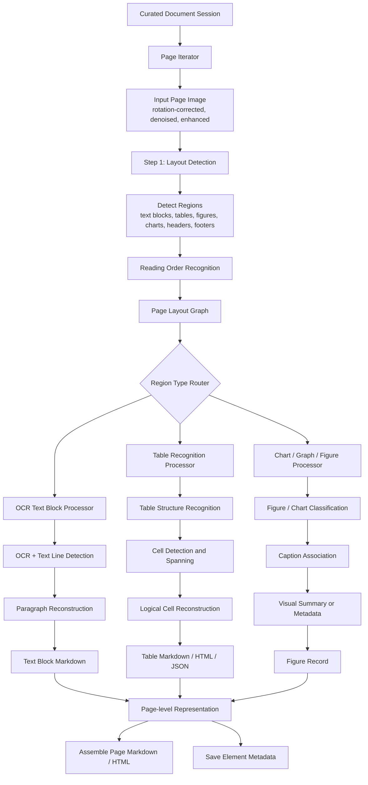

The **Parser** receives curated page images from the Curator module. Each input page has already been preprocessed, for example by rotation correction, denoising, enhancement, page splitting, and document-type classification.

The Parser works at the **page level**, but all pages from the same multi-page document are grouped under a shared **document session**. During parsing, the system does not only generate markdown, HTML, or plain text. It also stores detailed structured information about detected elements, such as tables, figures, charts, text blocks, coordinates, reading order, logical cells, page index, and visual grounding metadata, into a **session database**.

This allows downstream extraction agents to reason over both the textual content and the visual structure of the document.

