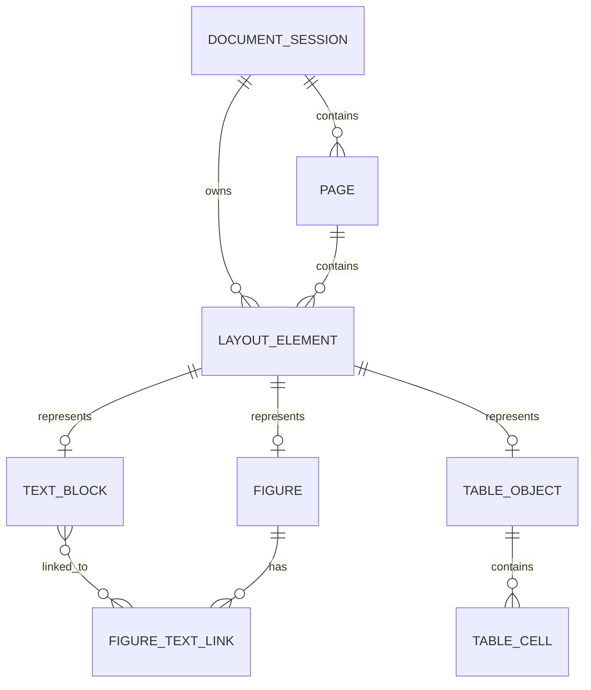

The **session database** is the central storage layer for one document-processing session. Each uploaded document creates a `session_id`. All pages, parsed elements, tables, figures, extracted fields, evidence spans, validation logs, and final JSON outputs are linked to this session.

The database should support four main goals:

First, it should preserve the **document hierarchy**:

```
DocumentSession
└── Page
    └── LayoutElement
        ├── TextBlock
        ├── Table
        │   └── TableCell
        └── Figure
```

Second, every parsed object should preserve **visual grounding**, including page number, bounding box, confidence score, and links back to the original page image.

Third, the database should support both **human-readable outputs** such as markdown and HTML, and **machine-readable outputs** such as JSON and structured table cells.

#### **2.3.3.1. Entity Relationship Overview**

