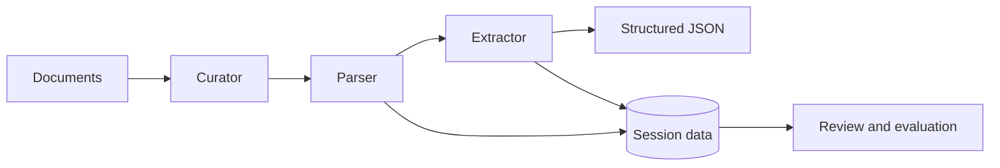

# CogniDoc

CogniDoc is an open-source workspace for building agentic document intelligence
systems. Its goal is to turn complex, unstructured documents into traceable,
structured data by combining document curation, visual parsing, schema-aware
extraction, and human inspection.

The repository currently includes a runnable **Data Studio** for managing
machine-learning datasets, plus research and early components for OCR, table
recognition, and document extraction.

> CogniDoc is under active development. The Data Studio is the most complete
> application today; the curator, parser, and extractor are evolving research
> components.

## Why CogniDoc?

Real-world documents are more than streams of text. Tables, reading order,
figures, page boundaries, and visual position all carry meaning. CogniDoc is
designed around a pipeline that preserves this structure:



- **Curator** prepares documents by splitting, cleaning, classifying, and
  grouping pages.
- **Parser** reconstructs text, tables, figures, layout, and reading order while
  retaining visual grounding.
- **Extractor** maps parsed evidence to a target schema, validates candidate
  values, and produces structured output.
- **Data Studio** stores, versions, previews, and shares the datasets used to
  develop and evaluate the pipeline.

## What is available

| Area | Status | Description |
| --- | --- | --- |
| Data Studio | Runnable | Self-hosted dataset repository, browser, API, and revision store |
| Table recognition | Research | Dataset-building, supervised fine-tuning, and RLVR experiments |
| OCR adapters | Experimental | Chandra OCR, PaddleOCR, and dummy tool integrations |
| Curator | Planned | Document preprocessing and page organization |
| Extractor | Planned | Schema-guided extraction and evidence validation |

### Data Studio highlights

The included [TonAI Data Studio](src/data_studio/README.md) accepts common
Hugging Face Dataset Hub repository layouts without reorganizing their files.
It provides:

- folder uploads with safe relative-path preservation;
- Dataset Card rendering from `README.md`;
- Parquet, CSV, TSV, JSON, JSONL, TXT, and ImageFolder discovery;
- dataset configs, splits, schemas, statistics, and bounded row previews;
- immutable, content-addressed revisions backed by Git and DVC;
- local or S3-compatible object storage;
- public, internal, and private dataset visibility;
- a FastAPI backend and React web interface; and
- a Docker Compose stack with PostgreSQL, Redis, Celery, and RustFS.

## Quick start

The quickest way to run the current application is with Docker Compose.

### Requirements

- Docker with the Compose plugin
- Git

### Start the stack

```bash
cd src/data_studio
cp .env.example .env
```

Replace the placeholder secrets in `.env`, then run:

```bash
docker compose --env-file .env \
  -f infrastructure/docker-compose.yml \
  up -d --build
```

Once the services are healthy, open:

- Web interface: <http://localhost:3000>
- API documentation: <http://localhost:8001/docs>
- RustFS console: <http://localhost:9001/rustfs/console/>

The first account registered in the Studio becomes the workspace
administrator.

Stop the services without deleting their persistent volumes:

```bash
docker compose --env-file .env \
  -f infrastructure/docker-compose.yml \
  down
```

For direct Python and Node.js development, configuration options, API examples,
and the complete feature list, see the
[Data Studio documentation](src/data_studio/README.md).

## Repository structure

```text
cognidoc/
├── src/
│   ├── curator/               # Document preparation (planned)
│   ├── parser/                # Experimental OCR tool adapters
│   ├── extractor/             # Structured extraction (planned)
│   └── data_studio/           # Runnable dataset management application
├── research/
│   ├── chandra2-parser/       # Chandra OCR experiments
│   ├── table_cell_detection/  # Table and cell detection experiments
│   ├── table_html_dataset/    # Table-to-HTML dataset tooling
│   └── table_recognition_vlm/ # SFT and RLVR training workflows
├── docs/                      # Architecture and design notes
└── asssets/                   # Samples and research assets
```

## Development

Data Studio uses Python 3.11+, FastAPI, SQLAlchemy, React, TypeScript, and
Vite. Direct development requires Python 3.11+, Node.js 22+, and
[`uv`](https://docs.astral.sh/uv/). From `src/data_studio`, install its
development dependencies:

```bash
uv pip install -e '.[dev]'
cd apps/web
npm ci
cd ../..
```

Run the backend checks:

```bash
ruff check apps/api tests migrations
ruff format --check apps/api tests migrations
mypy apps/api/data_studio_api
pytest
```

Run the frontend checks:

```bash
cd apps/web
npm run lint
npm test
npm run build
```

The research directories have separate dependencies and instructions. Start
with the [table-recognition SFT guide](research/table_recognition_vlm/sft/README.md)
or the [SFT + RLVR guide](research/table_recognition_vlm/rl/README.md).

## Documentation

- [Project vision and document-processing architecture](docs/INTRO.md)
- [Data Studio guide](src/data_studio/README.md)
- [Data Studio API examples](src/data_studio/docs/API_USAGE.md)
- [Session database design](docs/DATABASE.md)
- [English product documentation](src/data_studio/docs/DOCUMENTATION_en.md)
- [Vietnamese product documentation](src/data_studio/docs/DOCUMENTATION_vi.md)

## License

CogniDoc is available under the [MIT License](LICENSE).
