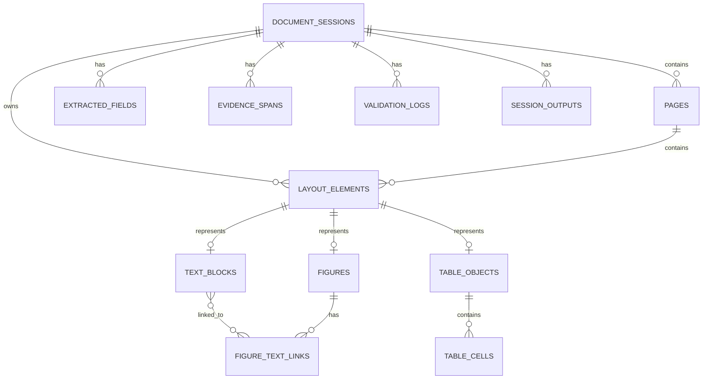

# Session Database

The session database is the persistent storage layer for one document-processing session. Each uploaded document receives a `session_id`, and every parsed page, layout element, table, figure, extracted field, evidence span, validation log, and final output is linked back to that session.

The current implementation is `SQLiteSessionDatabase` in `src/database/session.py`. It uses only the Python standard library and can run either in memory for tests or against a file path for local persistence.

## Goals

The database is designed around three requirements:

1. Preserve the document hierarchy from session to page to layout element.
2. Preserve visual grounding for parsed objects, including page index, bounding boxes, confidence scores, and original page image paths.
3. Store both human-readable outputs such as markdown and HTML and machine-readable outputs such as JSON and table cells.

## Hierarchy

```text
DocumentSession
└── Page
    └── LayoutElement
        ├── TextBlock
        ├── TableObject
        │   └── TableCell
        └── Figure
```

`layout_elements` is the common parent table for all parsed regions. Type-specific tables then store the structured representation for each element type:

- `text_blocks` stores OCR text, markdown, and HTML.
- `table_objects` stores table markdown, HTML, JSON, row count, and column count.
- `table_cells` stores logical cells with row and column indexes, spans, text, optional bounding boxes, and confidence.
- `figures` stores captions, summaries, image paths, markdown, HTML, and figure metadata.

## Schema Overview



## Core Tables

### `document_sessions`

Stores the top-level document processing session.

Important columns:

- `session_id`: stable identifier for the uploaded document.
- `source_path`: optional source document path from session metadata.
- `markdown`: document-level markdown output.
- `html`: document-level HTML output.
- `final_json`: latest machine-readable JSON output.
- `metadata_json`: session metadata.
- `created_at`, `updated_at`: audit timestamps.

### `pages`

Stores page-level parser output and page image references.

Important columns:

- `session_id`, `page_index`: unique page identity.
- `image_path`: path to the original or curated page image.
- `markdown`, `html`: page-level human-readable outputs.
- `width`, `height`: optional page dimensions.
- `metadata_json`: additional page metadata.

### `layout_elements`

Stores common metadata for all parsed page regions.

Important columns:

- `session_id`, `page_index`, `element_id`: stable element identity.
- `element_type`: `text`, `table`, `figure`, `chart`, `header`, or `footer`.
- `reading_order`: order used to reconstruct page output.
- `bbox_x`, `bbox_y`, `bbox_width`, `bbox_height`: page-space visual grounding.
- `confidence`: parser confidence.
- `image_path`: source page image path.
- `markdown`, `html`, `text`: common human-readable outputs.
- `data_json`: common machine-readable payload.
- `metadata_json`: processor metadata.

### `table_cells`

Stores structured table cell data for downstream extraction.

Important columns:

- `table_element_id`: parent table layout element.
- `row_index`, `column_index`: logical cell position.
- `row_span`, `column_span`: merged-cell support.
- `text`, `markdown`, `html`: cell content.
- `bbox_*`: optional cell-level visual grounding.
- `confidence`: cell confidence.

When a table element provides `data["cells"]`, those cells are persisted directly. If it only provides `data["rows"]`, the database derives simple logical cells from the row matrix.

## Extraction Tables

The database also reserves tables for downstream extraction and validation:

- `extracted_fields`: field name, JSON value, confidence, and metadata.
- `evidence_spans`: text evidence linked to page indexes, element IDs, optional bounding boxes, and confidence.
- `validation_logs`: validation stage, severity, message, and metadata.
- `session_outputs`: versioned outputs by type, including markdown, HTML, and JSON.

`save_final_json()` stores the latest JSON result on `document_sessions.final_json` and also appends a `json` record to `session_outputs`.

## Parser Integration

`SessionMetadataStore` in `src/parser/storage.py` is the parser-facing facade. It accepts either an existing `SQLiteSessionDatabase`, a database file path, or no argument.

```python
from src.database import SQLiteSessionDatabase
from src.parser import ParserWorkflow
from src.parser.storage import SessionMetadataStore

database = SQLiteSessionDatabase("sessions.sqlite3")
workflow = ParserWorkflow(metadata_store=SessionMetadataStore(database))
result = workflow.parse_session(curated_session)
```

During `parse_session()`, the workflow:

1. Saves the curated session and page image references.
2. Parses each page and persists its `PageRepresentation`.
3. Persists the document-level `ParserResult`.
4. Appends document markdown and HTML to `session_outputs`.

For tests, `InMemorySessionDatabase` remains available and now wraps `SQLiteSessionDatabase(":memory:")`.

## Query Helpers

The database exposes a small API for the current parser and tests:

- `save_session(session)`
- `save_page(page)`
- `save_parser_result(result)`
- `save_elements(session_id, elements)`
- `list_pages(session_id)`
- `list_elements(session_id)`
- `list_table_cells(session_id, table_element_id)`
- `link_figure_text(...)`
- `add_extracted_field(...)`
- `add_evidence_span(...)`
- `add_validation_log(...)`
- `add_session_output(...)`
- `save_final_json(...)`
- `get_session_summary(session_id)`

## Visual Grounding

Visual grounding is stored at multiple levels:

- Page image path on `pages.image_path`.
- Element image path on `layout_elements.image_path`.
- Element bounding boxes on `layout_elements.bbox_*`.
- Table cell bounding boxes on `table_cells.bbox_*`.
- Evidence span bounding boxes on `evidence_spans.bbox_*`.
- Confidence scores on layout elements, table cells, evidence spans, extracted fields, and figure-text links.

Bounding boxes use the parser `BoundingBox` contract:

```python
BoundingBox(x: float, y: float, width: float, height: float)
```

The current dummy processors use normalized page coordinates, but the schema only requires a consistent page-space coordinate system.

## Testing

Database behavior is covered by `tests/test_session_database.py`.

Run:

```bash
python -m unittest discover -s tests -v
```

The tests verify:

- Page, element, text block, table, table cell, and figure persistence.
- Bounding box and confidence round-tripping.
- Parser workflow persistence.
- Extraction fields, evidence spans, validation logs, session outputs, and final JSON storage.
