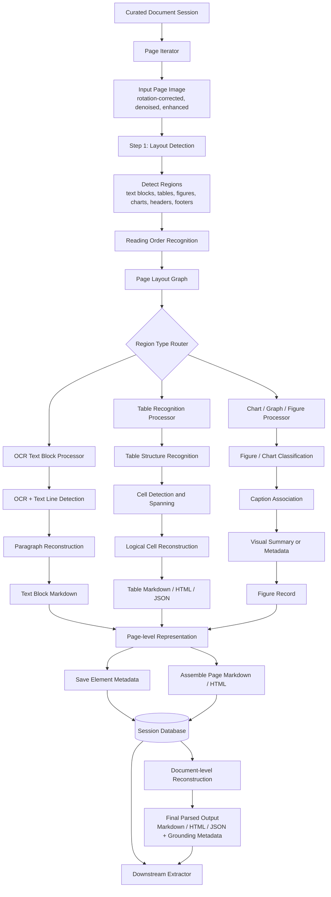
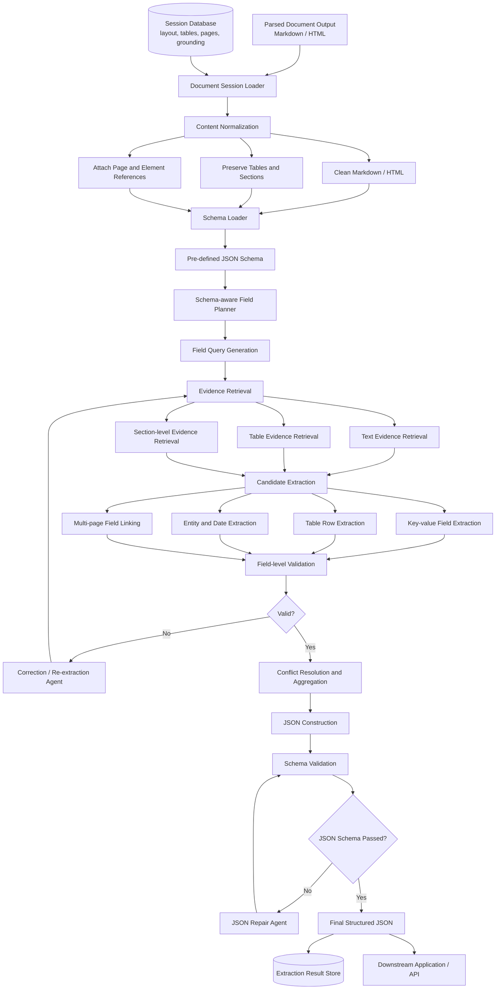
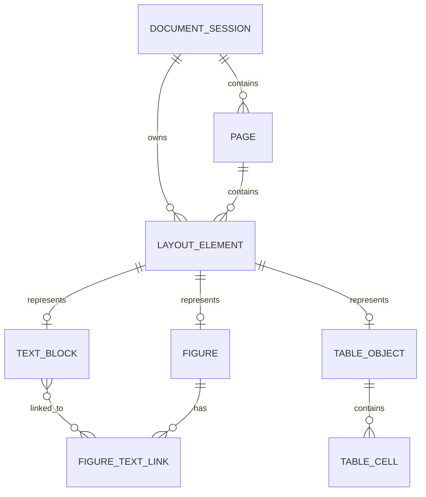

# Table of contents

# 1. What is Agentic AI?

Agentic AI refers to AI systems that can autonomously plan, decide, and act to achieve specific goals with minimal human intervention. Unlike traditional AI models that mainly respond to direct prompts, agentic AI can break complex tasks into steps, use external tools, monitor progress, and adapt its actions based on feedback.

In practical applications, agentic AI is used for tasks such as automated research, software development support, document analysis, workflow automation, and decision assistance. Its key strengths include autonomy, flexibility, and the ability to coordinate multiple actions across different systems. However, agentic AI also raises challenges related to reliability, transparency, safety, and human oversight, especially when deployed in high-stakes domains.

## **1.1. AI agent orchestration patterns**

| Level | Description | When to use | Considerations |
| --- | --- | --- | --- |
| **Direct model call** | A single language model call with a well-crafted prompt. No agent logic, no tool access. | Classification, summarization, translation, and other single-step tasks that the model can complete in one pass. | The least complex option. If prompt engineering can solve the problem, you don't need an agent. |
| **Single agent with tools** | One agent that reasons and acts by selecting from available tools, knowledge sources, and APIs. The agent can loop through multiple model calls and tool invocations to refine results. | Varied queries within a single domain where some requests require dynamic tool use, such as looking up order status or querying a database. | Often the right default for enterprise use cases. Simpler to debug and test than multi-agent setups, while still allowing dynamic logic. Guard against infinite tool-call loops by setting iteration limits. |
| **Multi-agent orchestration** | Multiple specialized agents coordinate to solve a problem. An orchestrator or peer-based protocol manages work distribution, context sharing, and result aggregation. | Cross-functional or cross-domain problems, scenarios that require distinct security boundaries per agent, or tasks that benefit from parallel specialization. | Adds coordination overhead, latency, and failure modes. Justify the added complexity by demonstrating that a single agent can't reliably handle the task due to prompt complexity, tool overload, or security requirements. |

### **1.1.1 Sequential orchestration**

The sequential orchestration pattern chains AI agents in a predefined, linear order. Each agent processes the output from the previous agent in the sequence, which creates a pipeline of specialized transformations.

*Also known as: pipeline, prompt chaining, linear delegation.*


### **1.1.2 Concurrent orchestration**

The concurrent orchestration pattern runs multiple AI agents simultaneously on the same task. This approach allows each agent to provide independent analysis or processing from its unique perspective or specialization.

*Also known as: parallel, fan-out/fan-in, scatter-gather, map-reduce.*


### **1.1.3. Group chat orchestration**

The group chat orchestration pattern enables multiple agents to solve problems, make decisions, or validate work by participating in a shared conversation thread where they collaborate through discussion. A chat manager coordinates the flow by determining which agents can respond next and by managing different interaction modes, from collaborative brainstorming to structured quality gates.

*Also known as: roundtable, collaborative, multi-agent debate, council.*


# 2. Agentic Document Extraction

## 2.1 Introduction

**Agentic Document Extraction (ADE)** is an intelligent document-processing service designed to transform complex, unstructured documents into reliable structured data. The system combines visual understanding, content reasoning, and workflow orchestration to handle diverse document types, including scanned forms, financial records, medical documents, contracts, and multi-page reports.

The service is organized into three main components. The **Curator** prepares input files before extraction by splitting large documents, classifying document types, filtering irrelevant pages, and organizing pages into meaningful groups. The **Parse** component focuses on document visual understanding, including layout analysis, text region detection, table recognition, reading order reconstruction, and interpretation of visual elements. Based on this parsed representation, the **Extract** component identifies target information and converts it into structured key-value data according to predefined schemas or user-defined templates.

By using an agentic workflow, the system can adapt its extraction strategy based on document complexity, validate intermediate results, and refine outputs when uncertainty is detected. This design improves robustness for heterogeneous document formats and enables scalable, auditable, and schema-guided document intelligence.

## 2.2. Related Works

Document extraction has evolved from traditional OCR-based pipelines toward more flexible, agentic systems that combine visual document understanding, layout-aware parsing, LLM reasoning, schema-guided extraction, and iterative validation. Recent tools such as **DocETL**, **Docling**, **LandingAI Agentic Document Extraction**, and **LlamaParse**represent different design choices in this emerging ecosystem. They vary in openness, deployment model, target users, and the degree to which they support end-to-end document intelligence.

**DocETL** is an LLM-powered data processing framework designed for building complex document-processing and ETL pipelines. Rather than being only a parser, DocETL focuses on pipeline orchestration, allowing users to define multi-step workflows for extracting, transforming, resolving, and aggregating information from unstructured text or documents. Its examples include tasks such as analyzing medical transcripts, extracting medication information, resolving entity variants, and generating summaries. This makes DocETL suitable for research scenarios where document extraction is not a single-step operation but a sequence of reasoning and transformation stages. In the context of agentic document extraction, DocETL is valuable as an orchestration layer: it can coordinate extraction prompts, merge partial outputs, apply validation logic, and refine results across multiple documents or chunks. However, it is less focused on low-level visual document parsing than tools specifically designed for PDF layout, OCR, or table reconstruction. ([GitHub](https://github.com/ucbepic/docetl?utm_source=chatgpt.com))

**Docling** is an open-source document processing toolkit developed around the goal of preparing documents for generative AI applications. It supports parsing and conversion of diverse document formats, with particular emphasis on advanced PDF understanding, table detection, reading order reconstruction, OCR, and structured output generation. Docling is especially relevant for the **parse** stage of a document extraction system, where the goal is to convert visually complex documents into machine-readable representations while preserving layout structure. Its open-source nature also makes it attractive for local deployment, reproducible research, and customization. Compared with cloud-only services, Docling provides greater control over data privacy and pipeline integration. However, downstream key-value extraction, schema alignment, and reasoning-based validation may still require additional LLM or agentic components. ([GitHub](https://github.com/docling-project/docling?utm_source=chatgpt.com))

**LandingAI Agentic Document Extraction (ADE)** is a commercial document intelligence platform designed to extract reliable structured data from visually complex documents. LandingAI describes ADE as going beyond conventional OCR and simple OCR-plus-LLM pipelines by using layout-aware and visually grounded extraction. Its API returns structured data with confidence scores, traceability, and element locations, which are important for auditability in enterprise workflows. The platform targets real-world documents such as forms, tables, charts, lab reports, and multi-page documents, and emphasizes production readiness rather than only research experimentation. Within an agentic document extraction architecture, LandingAI ADE can cover both parsing and extraction: it interprets visual regions, extracts schema-aligned information, and provides evidence grounding. Its main limitation is that it is a proprietary cloud/API-based service, which may reduce flexibility for fully local deployment or model-level customization. ([LandingAI](https://docs.landing.ai/ade/ade-overview?utm_source=chatgpt.com))

**LlamaParse**, developed by LlamaIndex, is a document parsing service intended for LLM and RAG pipelines. It supports many file types, including PDFs, Word documents, PowerPoint files, and spreadsheets, and converts documents into formats such as markdown, text, or JSON. Recent documentation describes LlamaParse as an agentic, layout-aware parser that can handle tables, charts, scanned pages, and more than 130 file types. Its strength lies in preparing clean, LLM-ready document representations that can be directly used for retrieval, indexing, and downstream extraction. Therefore, LlamaParse is particularly suitable for the **parse** and **RAG preparation** stages of document intelligence systems. Compared with Docling, LlamaParse is more tightly integrated with the LlamaIndex ecosystem and cloud-based document workflows. Compared with LandingAI ADE, it is more parser-oriented, although LlamaCloud extends the platform toward extraction and indexing. ([LlamaIndex](https://www.llamaindex.ai/llamaparse?utm_source=chatgpt.com))

Overall, these systems are complementary rather than strictly competing. **Docling** is well suited for open-source, local-first document parsing; **LlamaParse** is strong for LLM-ready parsing and RAG-oriented workflows; **LandingAI ADE** provides a production-oriented, visually grounded extraction API with traceability; and **DocETL** offers a flexible orchestration layer for building multi-step LLM-powered extraction and transformation pipelines. A practical agentic document extraction system could combine these ideas: a curator module first splits and classifies documents, a parser such as Docling or LlamaParse converts pages into structured representations, an extraction module such as LandingAI ADE or a custom VLM/LLM extracts key-value fields, and an orchestration framework such as DocETL manages validation, refinement, and aggregation.

## 2.3. Method

### 2.3.1. Parser Module

The **Parser** receives curated page images from the Curator module. Each input page has already been preprocessed, for example by rotation correction, denoising, enhancement, page splitting, and document-type classification.

The Parser works at the **page level**, but all pages from the same multi-page document are grouped under a shared **document session**. During parsing, the system does not only generate markdown, HTML, or plain text. It also stores detailed structured information about detected elements, such as tables, figures, charts, text blocks, coordinates, reading order, logical cells, page index, and visual grounding metadata, into a **session database**.

This allows downstream extraction agents to reason over both the textual content and the visual structure of the document.



### 2.3.2. Extraction

The **Extraction** module converts parsed document content into structured JSON according to a target schema. Unlike the Parser, which focuses on visual and layout understanding, the Extraction module focuses on **semantic understanding**, **field grounding**, **schema alignment**, and **output validation**.

The module should not simply ask an LLM to “extract everything.” Instead, it should use a controlled pipeline: load the target schema, retrieve relevant document chunks, extract candidate values, validate them, resolve conflicts, and finally generate a clean JSON object.



### 2.3.3 Session database

The **session database** is the central storage layer for one document-processing session. Each uploaded document creates a `session_id`. All pages, parsed elements, tables, figures, extracted fields, evidence spans, validation logs, and final JSON outputs are linked to this session.

The database should support four main goals:

First, it should preserve the **document hierarchy**:

```
DocumentSession
└── Page
    └── LayoutElement
        ├── TextBlock
        ├── Table
        │   └── TableCell
        └── Figure
```

Second, every parsed object should preserve **visual grounding**, including page number, bounding box, confidence score, and links back to the original page image.

Third, the database should support both **human-readable outputs** such as markdown and HTML, and **machine-readable outputs** such as JSON and structured table cells.

#### **2.3.3.1. Entity Relationship Overview**

