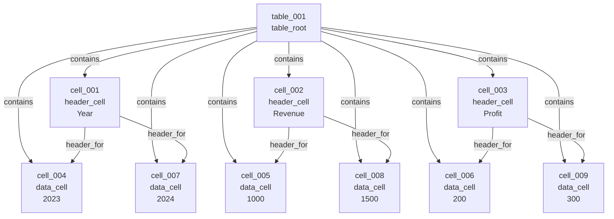

Here is the simplified Markdown version, with fewer graph relation types and all Label Studio-specific parts removed.

---

# Table Recognition Data Specification

## 1. Goal

This document defines a simple data format for table recognition.

A table is represented as a **hierarchical graph**. Each table contains cells, and each cell stores three kinds of information:

1. **Visual information**: where the cell appears in the image.
2. **Logical information**: where the cell belongs in the table grid.
3. **Content information**: text inside the cell.

The format is designed for table structure recognition, OCR, and downstream table understanding.

---

# 2. Table Representation

A table is represented as a graph.

The graph contains:

* **Nodes**: table, header cells, data cells, merged cells, empty cells.
* **Edges**: simple relations between nodes.

The main structure is a tree:

```text
table_root
├── header_cell
├── header_cell
├── data_cell
├── data_cell
└── ...
```

For more complex tables, headers may contain sub-headers:

```text
table_root
├── header_cell: Revenue
│   ├── header_cell: 2023
│   └── header_cell: 2024
├── data_cell
├── data_cell
└── ...
```

---

# 3. Node Types

Each node represents one table region.

| Node type     | Description                                  |
| ------------- | -------------------------------------------- |
| `table_root`  | The whole table                              |
| `header_cell` | A column header, row header, or group header |
| `data_cell`   | A normal body cell                           |
| `merged_cell` | A cell spanning multiple rows or columns     |
| `empty_cell`  | A visible blank cell                         |

Recommended rule:

Use `header_cell` for any cell that describes other cells. Use `data_cell` for normal values. Use `merged_cell` when a cell spans multiple rows or columns.

---

# 4. Edge Types

Use only a small set of relation types.

| Relation     |  Direction | Description                                      |
| ------------ | ---------: | ------------------------------------------------ |
| `contains`   |   Directed | Parent node contains child node                  |
| `header_for` |   Directed | A header describes a data cell or another header |
| `same_as`    | Undirected | Two cells are logically equivalent or repeated   |

## 4.1 `contains`

This is the main relation used to build the table tree.

Examples:

```text
table_root --contains--> header_cell
table_root --contains--> data_cell
header_cell --contains--> sub_header_cell
```

Use `contains` when one node is the parent of another node.

---

## 4.2 `header_for`

This relation connects headers to the cells they describe.

Examples:

```text
"Year" --header_for--> "2024"
"Revenue" --header_for--> "$10,000"
```

Use this relation when the header-cell relationship is clear.

---

## 4.3 `same_as`

This relation is used when two cells have the same logical meaning.

Example:

```text
cell_A --same_as-- cell_B
```

This is useful for repeated headers, duplicated labels, or continued tables across pages.

---

# 5. Cell Data Structure

Each cell node has three parts:

```text
cell
├── visual
├── logic
└── content
```

---

## 5.1 Visual Part

The visual part stores the bounding box of the cell.

```json
{
  "visual": {
    "bbox": [120, 240, 520, 310],
    "bbox_format": "xyxy",
    "bbox_unit": "pixel",
    "page_index": 0
  }
}
```

Field meaning:

| Field         | Description                         |
| ------------- | ----------------------------------- |
| `bbox`        | Bounding box of the cell            |
| `bbox_format` | Format of bbox, recommended: `xyxy` |
| `bbox_unit`   | Unit of bbox, recommended: `pixel`  |
| `page_index`  | Page number, starting from 0        |

The bbox format is:

```text
[x_min, y_min, x_max, y_max]
```

---

## 5.2 Logic Part

The logic part stores the position of the cell in the table grid.

```json
{
  "logic": {
    "row_start": 0,
    "row_end": 1,
    "col_start": 0,
    "col_end": 2,
    "row_span": 1,
    "col_span": 2,
    "logical_role": "column_header"
  }
}
```

Field meaning:

| Field          | Description               |
| -------------- | ------------------------- |
| `row_start`    | Start row index           |
| `row_end`      | End row index             |
| `col_start`    | Start column index        |
| `col_end`      | End column index          |
| `row_span`     | Number of rows covered    |
| `col_span`     | Number of columns covered |
| `logical_role` | Role of the cell          |

Use **0-based indexing**.

Use **end-exclusive indexing**:

```text
row_span = row_end - row_start
col_span = col_end - col_start
```

Example:

A merged cell covering columns 0 and 1:

```json
{
  "row_start": 0,
  "row_end": 1,
  "col_start": 0,
  "col_end": 2,
  "row_span": 1,
  "col_span": 2
}
```

---

## 5.3 Content Part

The content part stores the text inside the cell.

```json
{
  "content": {
    "text": "Revenue",
    "normalized_text": "revenue"
  }
}
```

Field meaning:

| Field             | Description                               |
| ----------------- | ----------------------------------------- |
| `text`            | Original text inside the cell             |
| `normalized_text` | Cleaned or normalized version of the text |

For empty cells:

```json
{
  "content": {
    "text": "",
    "normalized_text": ""
  }
}
```

---

# 6. Full Node Example

```json
{
  "node_id": "cell_001",
  "node_type": "header_cell",
  "visual": {
    "bbox": [120, 240, 520, 310],
    "bbox_format": "xyxy",
    "bbox_unit": "pixel",
    "page_index": 0
  },
  "logic": {
    "row_start": 0,
    "row_end": 1,
    "col_start": 0,
    "col_end": 2,
    "row_span": 1,
    "col_span": 2,
    "logical_role": "column_header"
  },
  "content": {
    "text": "Revenue",
    "normalized_text": "revenue"
  }
}
```

---

# 7. Full Table Example

```json
{
  "table_id": "table_001",
  "page_index": 0,
  "nodes": [
    {
      "node_id": "table_root_001",
      "node_type": "table_root",
      "visual": {
        "bbox": [100, 200, 900, 700],
        "bbox_format": "xyxy",
        "bbox_unit": "pixel",
        "page_index": 0
      },
      "logic": {
        "row_start": 0,
        "row_end": 3,
        "col_start": 0,
        "col_end": 3,
        "row_span": 3,
        "col_span": 3,
        "logical_role": "table"
      },
      "content": {
        "text": "",
        "normalized_text": ""
      }
    },
    {
      "node_id": "cell_001",
      "node_type": "header_cell",
      "visual": {
        "bbox": [100, 200, 300, 300],
        "bbox_format": "xyxy",
        "bbox_unit": "pixel",
        "page_index": 0
      },
      "logic": {
        "row_start": 0,
        "row_end": 1,
        "col_start": 0,
        "col_end": 1,
        "row_span": 1,
        "col_span": 1,
        "logical_role": "column_header"
      },
      "content": {
        "text": "Year",
        "normalized_text": "year"
      }
    },
    {
      "node_id": "cell_002",
      "node_type": "data_cell",
      "visual": {
        "bbox": [100, 300, 300, 400],
        "bbox_format": "xyxy",
        "bbox_unit": "pixel",
        "page_index": 0
      },
      "logic": {
        "row_start": 1,
        "row_end": 2,
        "col_start": 0,
        "col_end": 1,
        "row_span": 1,
        "col_span": 1,
        "logical_role": "data"
      },
      "content": {
        "text": "2024",
        "normalized_text": "2024"
      }
    }
  ],
  "edges": [
    {
      "edge_id": "edge_001",
      "source": "table_root_001",
      "target": "cell_001",
      "relation": "contains"
    },
    {
      "edge_id": "edge_002",
      "source": "table_root_001",
      "target": "cell_002",
      "relation": "contains"
    },
    {
      "edge_id": "edge_003",
      "source": "cell_001",
      "target": "cell_002",
      "relation": "header_for"
    }
  ]
}
```

---

# 8. Annotation Guide

## 8.1 Annotate the Table Root

First, draw or define the bounding box of the whole table.

Label it as:

```text
table_root
```

The table root should cover the entire table area, including all header cells and data cells.

---

## 8.2 Annotate All Cells

Annotate every visible cell in the table.

Each cell should have:

* one bounding box
* one node type
* one logical position
* one text content value

Recommended node types:

```text
header_cell
data_cell
merged_cell
empty_cell
```

---

## 8.3 Annotate Merged Cells

A merged cell should be annotated as one node.

Example:

```text
A header cell spans 3 columns
```

Its logic should be:

```json
{
  "row_start": 0,
  "row_end": 1,
  "col_start": 0,
  "col_end": 3,
  "row_span": 1,
  "col_span": 3
}
```

Do not split a merged cell into multiple small cells.

---

## 8.4 Annotate Empty Cells

If a blank cell is part of the table structure, annotate it.

Use:

```text
empty_cell
```

Its content should be:

```json
{
  "text": "",
  "normalized_text": ""
}
```

---

## 8.5 Annotate Header Relations

Use `header_for` to connect a header cell to the cells it describes.

Example:

```text
"Year" --header_for--> "2024"
"Revenue" --header_for--> "$10,000"
```

For simple tables, each column header should connect to the data cells under it.

For row headers, each row header should connect to the data cells on the same row.

---

## 8.6 Annotate Containment Relations

Every non-root node should be connected to a parent node by `contains`.

Minimum structure:

```text
table_root --contains--> cell
```

For hierarchical headers:

```text
table_root --contains--> header_cell
header_cell --contains--> sub_header_cell
```

---

# 9. Annotation Rules

Follow these rules when creating annotations:

1. Use one `table_root` for each table.
2. Use one node for each visible cell.
3. Use one node for each merged cell.
4. Do not split merged cells into smaller cells.
5. Use 0-based row and column indices.
6. Use end-exclusive `row_end` and `col_end`.
7. Use `contains` to build the hierarchy.
8. Use `header_for` only when the header relationship is clear.
9. Use `same_as` only for repeated or equivalent cells.
10. Keep original cell text in `content.text`.
11. Store cleaned text in `content.normalized_text`.

---

# 10. Quality Checklist

Before finalizing an annotation, check:

* [ ] The table has one `table_root`.
* [ ] All visible cells are annotated.
* [ ] Merged cells have correct `row_span` and `col_span`.
* [ ] Empty cells are annotated if they belong to the table grid.
* [ ] All cells have bounding boxes.
* [ ] All cells have logical row and column positions.
* [ ] All cells have content text, even if empty.
* [ ] All non-root nodes have a `contains` relation.
* [ ] Header cells have `header_for` relations when needed.
* [ ] The final graph has no cycles in `contains` edges.

---

# 11. Recommended Dataset Structure

```text
dataset/
├── images/
│   ├── page_001.png
│   └── page_002.png
├── annotations/
│   ├── page_001_table_001.json
│   └── page_002_table_001.json
└── README.md
```

---

# 12. Example

Here is a simple example you can add to the documentation.

## Example Table

Original table:

```markdown
| Year | Revenue | Profit |
|---|---:|---:|
| 2023 | 1000 | 200 |
| 2024 | 1500 | 300 |
```

Rendered table:

| Year | Revenue | Profit |
| ---- | ------: | -----: |
| 2023 |    1000 |    200 |
| 2024 |    1500 |    300 |

---

## Annotation Nodes

Each cell is annotated as one node.

| Node ID     | Node Type     |           BBox Example |   Row | Column | Text      |
| ----------- | ------------- | ---------------------: | ----: | -----: | --------- |
| `table_001` | `table_root`  |     `[0, 0, 600, 300]` | `0-3` |  `0-3` | `""`      |
| `cell_001`  | `header_cell` |      `[0, 0, 200, 80]` |   `0` |    `0` | `Year`    |
| `cell_002`  | `header_cell` |    `[200, 0, 400, 80]` |   `0` |    `1` | `Revenue` |
| `cell_003`  | `header_cell` |    `[400, 0, 600, 80]` |   `0` |    `2` | `Profit`  |
| `cell_004`  | `data_cell`   |    `[0, 80, 200, 160]` |   `1` |    `0` | `2023`    |
| `cell_005`  | `data_cell`   |  `[200, 80, 400, 160]` |   `1` |    `1` | `1000`    |
| `cell_006`  | `data_cell`   |  `[400, 80, 600, 160]` |   `1` |    `2` | `200`     |
| `cell_007`  | `data_cell`   |   `[0, 160, 200, 240]` |   `2` |    `0` | `2024`    |
| `cell_008`  | `data_cell`   | `[200, 160, 400, 240]` |   `2` |    `1` | `1500`    |
| `cell_009`  | `data_cell`   | `[400, 160, 600, 240]` |   `2` |    `2` | `300`     |

---

## Annotation Relations

| Source      | Relation     | Target     | Meaning                       |
| ----------- | ------------ | ---------- | ----------------------------- |
| `table_001` | `contains`   | `cell_001` | Table contains Year header    |
| `table_001` | `contains`   | `cell_002` | Table contains Revenue header |
| `table_001` | `contains`   | `cell_003` | Table contains Profit header  |
| `table_001` | `contains`   | `cell_004` | Table contains data cell      |
| `cell_001`  | `header_for` | `cell_004` | Year describes 2023           |
| `cell_001`  | `header_for` | `cell_007` | Year describes 2024           |
| `cell_002`  | `header_for` | `cell_005` | Revenue describes 1000        |
| `cell_002`  | `header_for` | `cell_008` | Revenue describes 1500        |
| `cell_003`  | `header_for` | `cell_006` | Profit describes 200          |
| `cell_003`  | `header_for` | `cell_009` | Profit describes 300          |

---

## Mermaid Graph



This example shows the basic idea: the table root contains all cells, and header cells point to the data cells they describe.

---

# 13. Summary

The simplified table data format represents each table as a graph with only three relation types:

```text
contains
header_for
same_as
```

Each cell is represented as a node with:

```text
visual part  = bbox coordinates
logic part   = row/column position and span
content part = text inside the cell
```

This keeps the annotation format simple while still supporting hierarchical table structure, merged cells, headers, and logical table understanding.
