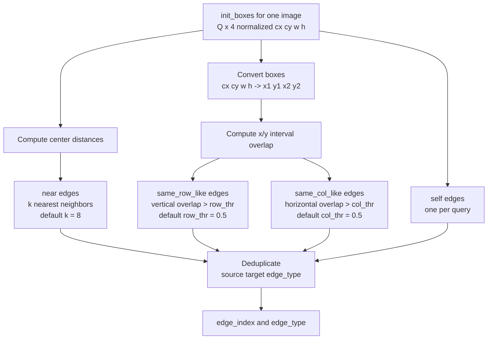
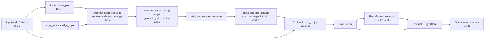
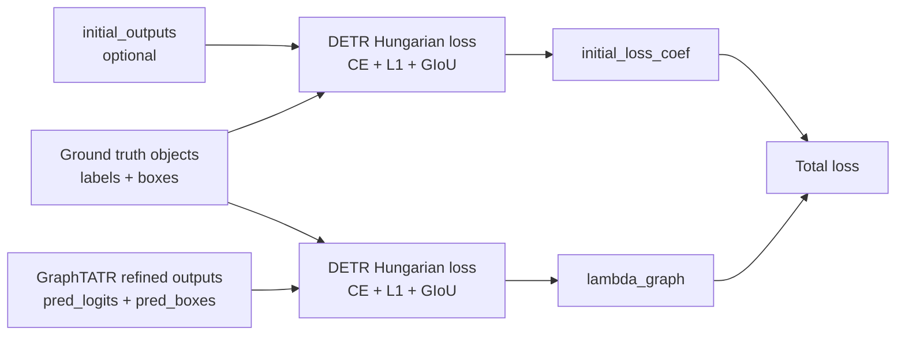

# GraphTATR Architecture

This document visualizes the implemented GraphTATR model in `detr/models/graph_tatr.py`.

GraphTATR keeps the Table Transformer backbone, encoder, decoder, and initial prediction heads. It adds a graph refinement block after the final decoder hidden states.

## High-Level Flow

```mermaid
flowchart LR
    image["Table image batch<br/>NestedTensor B x 3 x H x W"]
    backbone["ResNet backbone<br/>features + mask"]
    proj["1 x 1 input projection<br/>C -> D"]
    encoder["Transformer encoder"]
    decoder["Transformer decoder<br/>Q object queries"]
    hs["Decoder hidden states<br/>B x Q x D"]

    init_heads["Initial TATR heads"] 
    init_logits["init_logits<br/>B x Q x C+1"]
    init_boxes["init_boxes<br/>B x Q x 4<br/>normalized cx cy w h"]

    node_features["Node features<br/>decoder embeddings<br/>optional bbox/class features"]
    graph_builder["Graph builder<br/>from init_boxes"]
    edge_index["edge_index<br/>2 x E"]
    edge_type["edge_type<br/>E"]

    gat1["GraphAttentionLayer 1"]
    gat2["GraphAttentionLayer 2"]
    refined_features["Refined query features<br/>B x Q x D"]

    refined_heads["Refined heads"]
    pred_logits["pred_logits<br/>B x Q x C+1"]
    pred_boxes["pred_boxes<br/>B x Q x 4"]

    image --> backbone --> proj --> encoder --> decoder --> hs
    hs --> init_heads
    init_heads --> init_logits
    init_heads --> init_boxes

    hs --> node_features
    init_boxes --> graph_builder
    graph_builder --> edge_index
    graph_builder --> edge_type
    node_features --> gat1
    edge_index --> gat1
    edge_type --> gat1
    gat1 --> gat2 --> refined_features --> refined_heads
    refined_heads --> pred_logits
    refined_heads --> pred_boxes
```



## Graph Construction

Each decoder query is one graph node. Edges are built independently for each image in the batch from the initial predicted boxes.



Implemented edge types:

| ID | Name | Meaning |
|---:|---|---|
| 0 | `near` | Queries with nearby box centers |
| 1 | `same_row_like` | Boxes with strong vertical overlap |
| 2 | `same_col_like` | Boxes with strong horizontal overlap |
| 3 | `self` | Node self-loop for stable message passing |

## Graph Attention Layer

The current implementation is dependency-free and does not require PyTorch Geometric.



## Forward Pass With Tensors

```text
Input:
    samples.tensors        [B, 3, H, W]
    samples.mask           [B, H, W]

Base Table Transformer:
    backbone features      [B, C, H', W']
    projected features     [B, D, H', W']
    decoder states hs      [num_decoder_layers, B, Q, D]

Initial predictions:
    init_logits            [B, Q, num_classes + 1]
    init_boxes             [B, Q, 4]

Graph refinement per image:
    node_features[b]       [Q, D]
    edge_index[b]          [2, E]
    edge_type[b]           [E]
    refined_features[b]    [Q, D]

Final outputs:
    pred_logits            [B, Q, num_classes + 1]
    pred_boxes             [B, Q, 4]
    initial_outputs        original TATR logits/boxes for optional auxiliary loss
```

## Training Loss Flow

The training script supervises the refined graph output by default. It can optionally also supervise the initial TATR output.



Default:

```text
total_loss = 1.0 * refined_detr_loss
```

With initial supervision:

```text
total_loss = initial_loss_coef * initial_detr_loss
           + lambda_graph * refined_detr_loss
```

## Trainable Parts By Strategy

| Strategy | Base backbone | Base encoder | Base decoder | Graph layers | Refined heads |
|---|---|---|---|---|---|
| `graph_only` | frozen | frozen | frozen | trainable | trainable |
| `decoder_graph` | frozen | frozen | trainable | trainable | trainable |
| `full` | trainable | trainable | trainable | trainable | trainable |

## Code Map

| Component | File |
|---|---|
| Graph builder | `detr/models/graph_tatr.py::build_graph_from_boxes` |
| Graph layer | `detr/models/graph_tatr.py::GraphAttentionLayer` |
| Graph model | `detr/models/graph_tatr.py::GraphTATR` |
| Model factory | `detr/models/graph_tatr.py::build_graph_tatr` |
| Training script | `src/train_graph_tatr.py` |
| Default config | `src/graph_tatr_config.json` |

## Netron Export

A dummy TorchScript model has been exported for Netron:

```text
artifacts/graph_tatr_dummy_torchscript.pt
```

Open that file in Netron to inspect the traced GraphTATR graph. The dummy input used for this artifact is:

```text
[1, 3, 256, 256]
```

To regenerate it:

```bash
cd research/table_recognition/baselines/table-transformer
python src/export_graph_tatr_netron.py \
  --format torchscript \
  --height 256 \
  --width 256 \
  --output artifacts/graph_tatr_dummy_torchscript.pt
```

To export with a trained checkpoint:

```bash
python src/export_graph_tatr_netron.py \
  --checkpoint /path/to/model.pth \
  --format torchscript \
  --output artifacts/graph_tatr_trained_torchscript.pt
```

The script also supports `--format onnx`, but TorchScript is the safer default for this implementation because graph edges are built dynamically from predicted boxes.
