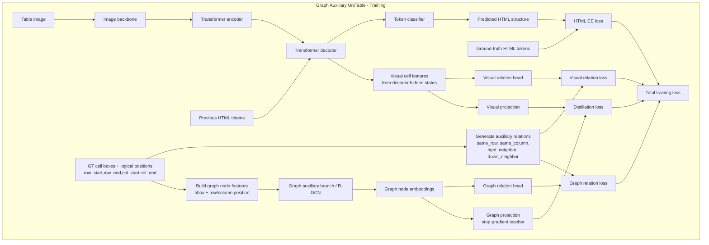
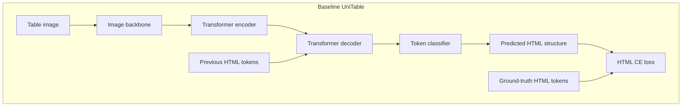
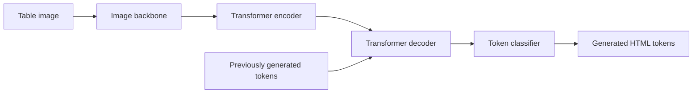

# Model Architecture

This note describes the two variants compared in this run:

- `baseline`: a compact UniTable-style image-to-HTML sequence model.
- `graph_aux`: the same decoder model with training-only auxiliary graph supervision.

The auxiliary branch is designed to teach table topology from cell boxes and logical cell positions while keeping the deployed prediction path unchanged. At inference time, both variants use the image encoder, transformer decoder, and token classifier to generate HTML tokens.

## High-Level Comparison





## Baseline UniTable Path

The baseline is a sequence model for table structure recognition. It consumes a normalized table image and autoregressively predicts HTML-like table tokens.

Primary stages:

- `Table image`: input image resized to the configured image size.
- `Image backbone`: extracts visual feature maps from the table image.
- `Transformer encoder`: contextualizes image features.
- `Transformer decoder`: conditions on encoder features and previous target tokens.
- `Token classifier`: maps decoder hidden states to vocabulary logits.
- `HTML CE loss`: cross-entropy between predicted token logits and ground-truth HTML tokens.

In this run, the baseline uses only the sequence objective:

```text
L_baseline = L_html
```

## Graph Auxiliary Variant

The `graph_aux` variant keeps the baseline prediction path intact and adds three auxiliary training signals:

- A visual relation head over decoder-derived cell features.
- A graph relation head over ground-truth cell geometry and logical positions.
- A distillation term that aligns visual cell features with graph node embeddings.

These auxiliary heads are used for training regularization. They are not needed to produce HTML tokens at inference time.

### Ground-Truth Cell Graph

Each table cell is treated as a graph node. Node features are built from the available cell annotations:

- Bounding box coordinates.
- Logical row span: `row_start`, `row_end`.
- Logical column span: `col_start`, `col_end`.

The auxiliary relation labels are generated from the same annotations:

| Relation | Meaning |
|---|---|
| `same_row` | Two cells occupy or overlap the same logical row region. |
| `same_column` | Two cells occupy or overlap the same logical column region. |
| `right_neighbor` | One cell is the immediate logical neighbor to the right. |
| `down_neighbor` | One cell is the immediate logical neighbor below. |

These labels supervise table topology rather than cell text content.

### Visual Relation Head

The decoder hidden states provide the model's visual-token representation of the predicted table sequence. The graph-auxiliary model extracts cell-aligned visual features from these hidden states and predicts pairwise relation labels between cells.

The visual relation loss encourages the decoder representation to encode row, column, and neighbor structure directly:

```text
L_visual_rel = relation_loss(visual_relation_logits, gt_relations)
```

### Graph Relation Head

The graph auxiliary branch receives ground-truth node features and produces graph node embeddings. A relation head then predicts the same relation set from graph embeddings:

```text
L_graph_rel = relation_loss(graph_relation_logits, gt_relations)
```

This branch acts as a topology-aware teacher. It can learn relations from clean geometry and logical positions even when the sequence decoder representation is still noisy.

### Visual-Graph Distillation

The model projects both visual cell features and graph node embeddings into a shared space. The graph side is treated as a stop-gradient teacher, so the distillation term updates the visual representation without pulling the graph teacher toward the visual branch:

```text
L_distill = distance(project_visual(visual_cell_features), stopgrad(project_graph(graph_node_embeddings)))
```

The purpose is to transfer relation-aware structure from the graph branch into the decoder representation used by the HTML token classifier.

## Training Objective

The graph-auxiliary variant optimizes the primary HTML objective plus weighted auxiliary losses:

```text
L_graph_aux = L_html
            + lambda_visual_rel * L_visual_rel
            + lambda_graph_rel  * L_graph_rel
            + lambda_distill    * L_distill
```

For this run, the configured weights were:

| Loss weight | Value |
|---|---:|
| `lambda_visual_rel` | `0.2` |
| `lambda_graph_rel` | `0.1` |
| `lambda_distill` | `0.1` |

Because `graph_aux.loss` includes these additional terms, it should not be compared directly with `baseline.loss` as a pure HTML sequence loss. Use `html_loss` when comparing the primary token-generation objective.

## Inference Path

The intended inference path is the same for both variants:



The graph branch, visual relation head, graph relation head, and distillation projection are training aids. They can be omitted at inference unless relation diagnostics are explicitly required.

## Metric Interpretation

The architecture changes target structural regularization more than direct cell-content prediction.

Important metric distinctions:

| Metric | Scope | Expected sensitivity |
|---|---|---|
| `html_loss` | Cross-entropy for the primary HTML sequence | Best direct comparison of token-generation quality. |
| `token_acc` | Accuracy over decoded output tokens | Sensitive to overall sequence and structure-token quality. |
| `cell_token_acc` | Accuracy over cell-associated token positions | More sensitive to cell content and alignment. |
| `structure_relation_f1` | Relations recovered from the main generated structure | Measures whether the final decoder output improves topology. |
| `aux_relation_f1` | Relations predicted by the auxiliary branch | Measures whether the auxiliary supervision itself is learnable. |

In this run, the auxiliary branch learned relation prediction well, and the final `html_loss` and `token_acc` improved. However, `structure_relation_f1` did not improve, which means the learned auxiliary signal did not translate into a measurable improvement in the final decoded table topology for this experiment.

## Run Configuration

Key architecture and training settings from `comparison_summary.json`:

| Setting | Value |
|---|---:|
| Epochs | `50` |
| Batch size | `32` |
| Learning rate | `0.0003` |
| Weight decay | `0.0001` |
| Image size | `128` |
| Max sequence length | `64` |
| Model dimension | `128` |
| Attention heads | `4` |
| Encoder layers | `2` |
| Decoder layers | `2` |
| Feed-forward ratio | `2` |
| Dropout | `0.1` |
| Seed | `1234` |

## Design Rationale

The graph auxiliary design is useful when the main token decoder needs stronger structural bias but the production interface should remain a standard image-to-HTML model.

Benefits:

- Adds explicit supervision for table topology.
- Regularizes decoder hidden states without changing the deployed prediction path.
- Provides auxiliary diagnostics through relation losses and `aux_relation_f1`.

Limitations observed in this run:

- The auxiliary objective can compete with the cell-token objective.
- Better auxiliary relation prediction does not guarantee better final decoded structure.
- The primary relation metric can saturate early, making downstream improvements hard to observe on this split.

Overall, the `graph_aux` model should be viewed as a training-regularized UniTable variant. It improved the final token-generation objective in this comparison, but the current configuration did not produce a measurable gain in final structure-relation F1.
