# Chandra 2 Vision Pretraining Plan for Document AI

## Goal

Adapt the **Chandra 2 vision encoder** using approximately **20M document pages**, then reconnect it to the original VLM and perform document SFT.

Recommended pipeline:

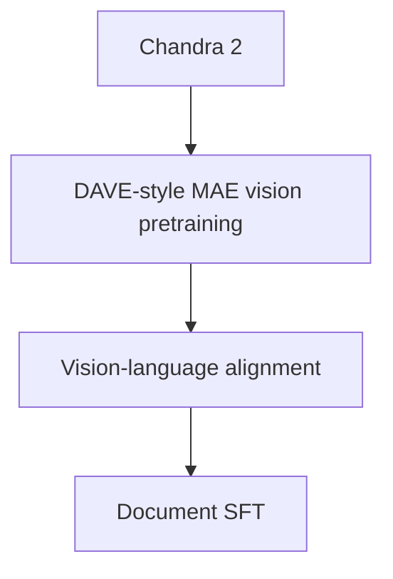

Keep a direct-SFT baseline:

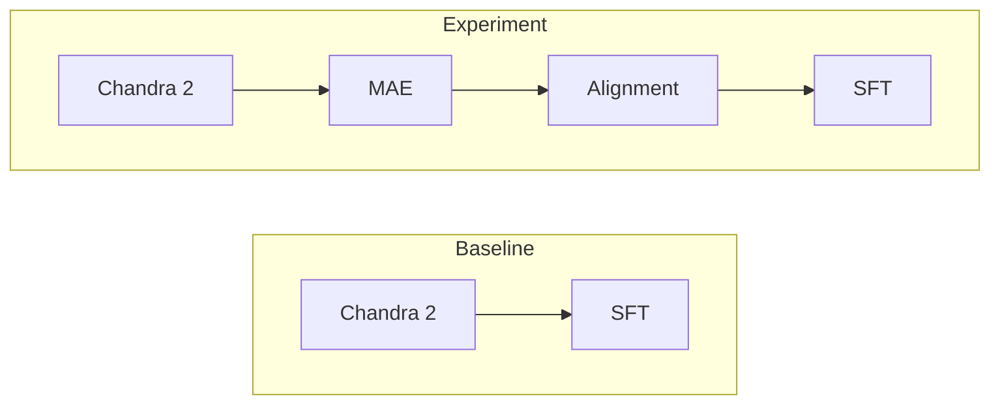

The MAE stage is worthwhile only if the final model improves downstream document performance over direct SFT.

---

## Recommended Method: DAVE-Style Raw-Pixel MAE

The most recommended method is a **masked autoencoder adapted for document images**, following the approach used in DAVE.

The main idea is:

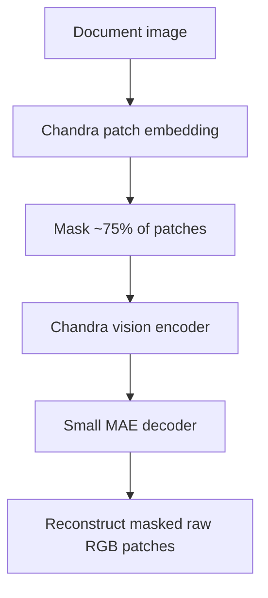

Use the existing Chandra 2 vision encoder rather than training a new ViT from scratch.

The MAE decoder is temporary and should be discarded after pretraining.

### Why this method

DAVE is particularly relevant because it performs document-focused visual pretraining on approximately **20M images**, which is very close to the current data scale.

A key result from DAVE is that standard MAE-style **per-patch normalization may be unstable for document and web images** because many patches contain very low visual variance.

Instead, DAVE reconstructs **raw pixel values**.

For this project, use:

```text
target:
    raw RGB patch values

loss:
    MSE on masked patches
```

rather than normalized patch reconstruction as the first experiment.

---

## Model Design

Reuse the native Chandra 2 vision tower.

Conceptually:

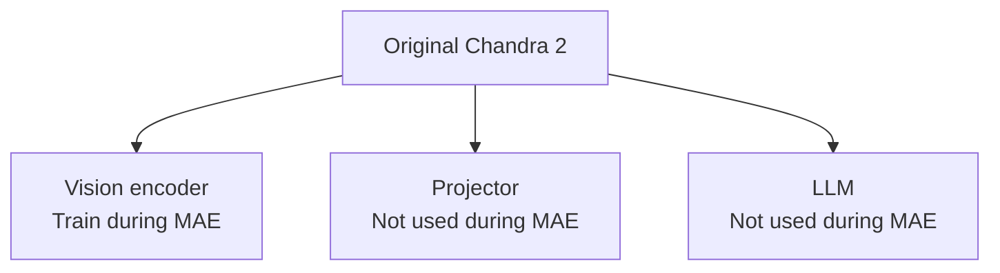

During SSL:

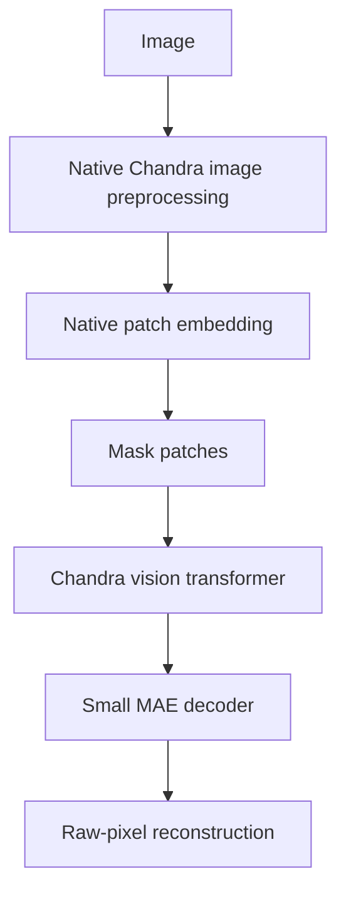

Do not replace Chandra's vision tower with `ViTMAEModel`.

The goal is to update the exact visual representation already used by Chandra.

---

## Masking Strategy

Start with the simplest and best-supported setup:

```text
mask ratio:
    75%

mask type:
    random patch masking
```

Do not start with complicated document-aware masking.

First establish whether the basic DAVE-style recipe improves Chandra.

Only after that, test:

```text
random + rectangular block masking
```

and later, if useful:

```text
text-line masking
table-region masking
layout-region masking
```

This keeps the initial experiment easy to interpret.

---

## MAE Decoder

Use a lightweight Transformer decoder.

Suggested starting configuration:

```text
hidden size:
    384-512

layers:
    4

attention heads:
    6-8
```

The decoder should be much smaller than the Chandra vision encoder.

After MAE training:

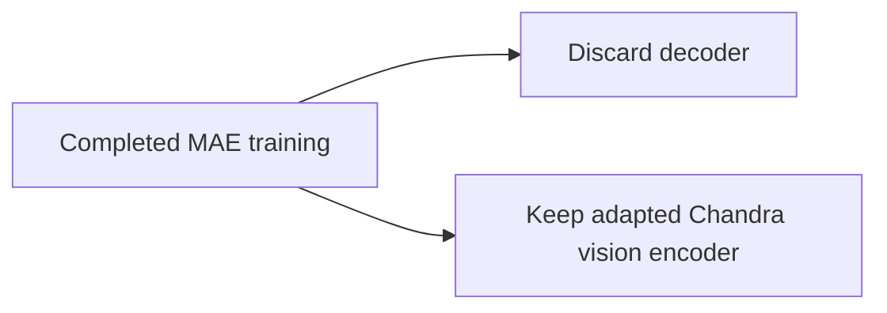

---

## Training Objective

For each masked patch:

```text
L_MAE =
    MSE(predicted_raw_pixels,
        target_raw_pixels)
```

Calculate loss only on masked patches.

Do not normalize each patch independently in the first experiment.

This directly follows the main practical finding from DAVE.

---

## Initial Training Configuration

Recommended starting point:

```text
Initialization:
    Chandra 2 vision encoder

Mask ratio:
    75%

Masking:
    random

Loss:
    raw-pixel MSE

Vision LR:
    5e-6 to 1e-5

MAE decoder LR:
    ~1e-4

Optimizer:
    AdamW

Weight decay:
    ~0.05

Precision:
    BF16

Warmup:
    3-5%

Scheduler:
    cosine decay

Effective batch:
    512-1024 if hardware permits
```

Because Chandra 2 is already pretrained, use a much more conservative training duration than a model trained from scratch.

---

## Pilot Training

Do not start immediately with all 20M pages.

Use approximately:

```text
0.5M-1M representative pages
```

for the first pilot.

Suggested duration:

```text
5k-10k steps
```

Check:

- reconstruction loss stability
- patch masking correctness
- gradient stability
- vision encoder checkpoint loading
- reinsertion into the full Chandra model
- OCR quality before and after MAE
- catastrophic representation drift

The most important technical checkpoint is confirming that the MAE-trained vision weights can be restored into the original Chandra checkpoint without changing model compatibility.

---

## Full-Scale Training

With effective batch size 1024:

```text
20,000,000 / 1024
≈ 19,531 steps per corpus pass
```

Recommended first full run:

```text
40k-60k steps
```

This corresponds to roughly:

```text
2-3 passes over the corpus
```

Evaluate before extending further.

Do not automatically copy DAVE's full training schedule because DAVE's encoder is trained from scratch, while this project performs **domain adaptation of an already-trained Chandra vision encoder**.

---

## Vision-Language Alignment

After MAE, the visual representation will have changed.

The original model expects:

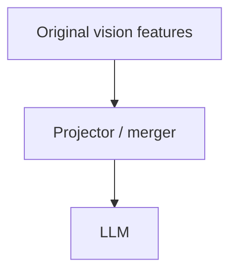

After pretraining:

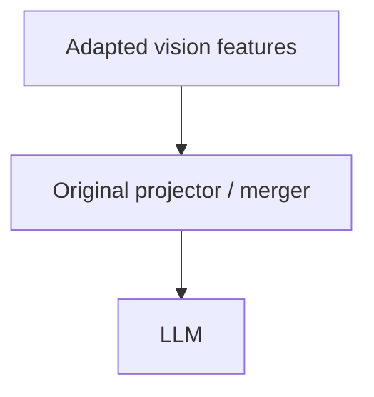

This distribution shift can reduce VLM performance even if the new vision encoder is better.

Therefore perform a short alignment stage before final SFT.

### Alignment data

Useful targets include:

```text
image -> OCR text

image -> Markdown

image -> HTML

image -> text + bounding boxes

image -> layout JSON

image -> table HTML
```

If native PDF text/layout is available, use it here.

### Alignment training

Recommended first configuration:

```text
Vision encoder:
    frozen or very small LR

Projector / merger:
    train

LLM:
    initially frozen
```

Possible learning rates:

```text
vision:
    1e-6 to 5e-6

projector / merger:
    5e-5 to 2e-4
```

The purpose is to teach the multimodal stack how to interpret the adapted visual features.

---

## Final SFT

After alignment, train Chandra on the actual production tasks.

Examples:

```text
image -> Markdown

image -> OCR text

image -> table HTML

image -> layout JSON

image -> key-value JSON

image -> document QA
```

Suggested initial setup:

```text
vision encoder:
    frozen or tiny LR

vision projector:
    train

LLM:
    LoRA or normal SFT
```

Use the same SFT dataset for the baseline and MAE experiment so the comparison is fair.

---

## Minimal Experiment Plan

Only two experiments are required initially.

| Experiment | Vision Pretraining | Alignment | SFT |
|---|---|---|---|
| A | None | No | Yes |
| B | DAVE-style raw-pixel MAE | Yes | Yes |

The key comparison is:

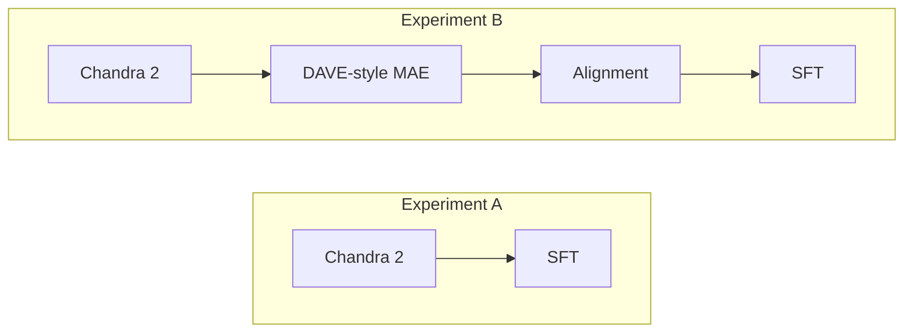

If B clearly outperforms A, then continue investing in vision SSL.

If not, additional MAE complexity is unlikely to be worth the compute.

---

## Evaluation

Do not select checkpoints only from MAE reconstruction loss.

Evaluate the complete model after alignment and SFT.

### OCR

```text
CER
WER
normalized edit distance
```

### Layout

```text
block F1
IoU / mAP
reading-order accuracy
```

### Tables

```text
TEDS
structure accuracy
cell-text accuracy
```

### Structured extraction

```text
exact match
field F1
JSON validity
```

Also keep a general Chandra validation set.

The target is:

```text
better target-domain performance
without unacceptable regression
on existing Chandra capabilities
```

---

## Related Work

### DAVE — Document and Visual Encoder

**arXiv:2512.17221**  
https://arxiv.org/abs/2512.17221

**Summary:** DAVE performs large-scale visual pretraining on approximately 20M document and web images using MAE, followed by supervised document-oriented training.

A key finding is that standard per-patch normalized MAE reconstruction can be problematic for document/web images. DAVE instead reconstructs raw pixels and reports stable large-scale training.

It also shows that document-pretrained visual features perform better than web-only visual features on document benchmarks such as DocBank and DocLayNet.

**Why it matters:** This is the most directly relevant paper to the current project because both the domain and data scale are very similar.

---

### MAE — Masked Autoencoders Are Scalable Vision Learners

**He et al., CVPR 2022**  
https://arxiv.org/abs/2111.06377

**Summary:** MAE masks a large percentage of image patches, encodes visible patches, and uses a lightweight decoder to reconstruct the missing image content.

The original MAE work demonstrates that high mask ratios such as 75% can produce strong visual representations while reducing encoder computation.

**Why it matters:** DAVE builds on the MAE framework. This paper provides the core architecture and masking strategy behind the recommended method.

---

### DiT — Self-supervised Pre-training for Document Image Transformer

**Li et al., ACM MM 2022**  
https://arxiv.org/abs/2203.02378

**Summary:** DiT applies masked visual pretraining directly to document images and shows improvements on tasks such as document classification, layout analysis, table detection, and text detection.

**Why it matters:** It provides earlier evidence that large-scale self-supervised pretraining on document images can improve document-specific visual representations.

---

### StrucTexTv2

**Yu et al., ICLR 2023**  
https://arxiv.org/abs/2303.00289

**Summary:** StrucTexTv2 performs document-specific masked visual-textual pretraining and introduces masking based on meaningful text regions rather than arbitrary patches alone.

**Why it matters:** This is useful as a future extension if basic DAVE-style random masking works and more document-aware masking is worth exploring.

---

## Recommended Reading Order

```text
1. DAVE
   -> directly relevant document MAE recipe
   -> approximately 20M-image scale
   -> raw-pixel reconstruction finding

2. MAE
   -> original masked-autoencoder design

3. DiT
   -> document-specific MAE evidence

4. StrucTexTv2
   -> possible future document-aware masking
```

---

## Final Recommendation

Use **DAVE-style raw-pixel MAE** as the only initial vision-pretraining method.

Start with:

```text
Chandra 2 vision encoder

75% random patch masking

raw RGB reconstruction

masked-patch MSE

vision LR:
    5e-6 to 1e-5

pilot:
    ~1M pages
```

Then:

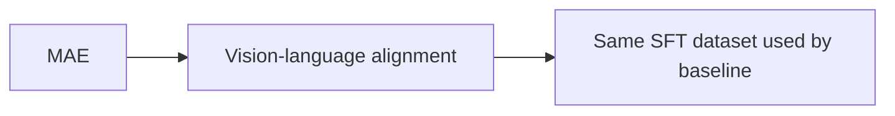

Compare against:

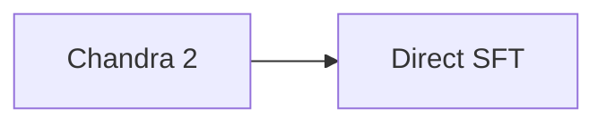

Only if the MAE path wins should more complex masking strategies or SSL objectives be explored.
