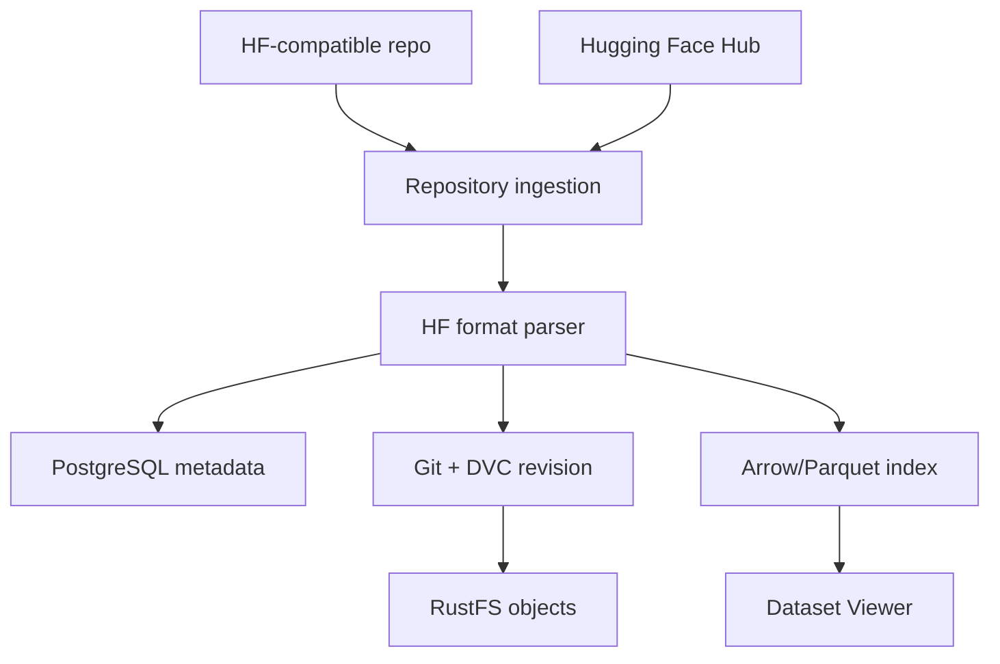

# Data Studio Architecture and Data Storage Specification

[](./DOCUMENTATION_en.md)
[](./DOCUMENTATION_vi.md)

| Document attribute | Value |
| --- | --- |
| Status | Normative architecture specification |
| Intended audience | AI researchers and AI research engineering teams |
| Applies to | All production implementations of Data Studio |
| Primary concern | Repository ingestion, immutable revisioning, storage, indexing, and dataset serving |

## 1. Scope

This document specifies the target architecture and mandatory data lifecycle for Data Studio. It is
the engineering baseline for design, implementation, testing, deployment, and operational review.
It is independent of any prototype or incremental delivery plan.

Data Studio SHALL accept repositories that follow the common Hugging Face dataset repository
contract. It SHALL preserve source content, create reproducible immutable revisions, maintain a
transactional metadata catalog, and expose revision-scoped data through a Dataset Viewer and
download APIs.

The specification covers:

- repository upload and Hugging Face Hub import;
- repository validation and Hugging Face layout parsing;
- PostgreSQL metadata and state management;
- Git and DVC revision creation;
- RustFS object storage;
- Arrow/Parquet index generation;
- dataset preview, query, download, export, retention, and recovery;
- consistency, security, observability, and acceptance requirements.

Full compatibility with every Hugging Face Hub network endpoint is outside the scope of this
architecture. Repository-format compatibility is mandatory; protocol emulation is a separate
concern.

### 1.1 Normative language

The terms **SHALL**, **SHALL NOT**, **SHOULD**, **SHOULD NOT**, and **MAY** define requirement
strength:

- **SHALL/SHALL NOT**: mandatory for conformance;
- **SHOULD/SHOULD NOT**: expected unless an approved architecture decision records a justified
  exception;
- **MAY**: optional behavior that must not violate a mandatory requirement.

### 1.2 Definitions

| Term | Definition |
| --- | --- |
| Repository | A named dataset container identified by a stable internal ID and exposed as `{namespace}/{dataset}` |
| Source tree | The complete set of uploaded/imported files and their normalized relative paths |
| Revision | An immutable, published snapshot of one source tree and its parsed logical layout |
| Manifest | The canonical, checksummed description of all files and logical layout in a revision |
| Config | A named dataset configuration or subset |
| Split | A named partition such as `train`, `validation`, or `test` within a config |
| Source object | A byte-identical immutable copy of an input file |
| Derived artifact | A rebuildable output such as an index, schema, statistic, or thumbnail |
| Publication barrier | The final atomic operation that makes a complete revision visible to readers |

## 2. Reference architecture



The reference flow is:

```text
HF-compatible repository ─┐
                          ├─> Repository ingestion ─> HF format parser
Hugging Face Hub ─────────┘                              │
                                                        ├─> PostgreSQL metadata
                                                        ├─> Git + DVC revision ─> RustFS objects
                                                        └─> Arrow/Parquet index ─> Dataset Viewer
```

The parser produces three coordinated outputs:

1. **Catalog plane** — PostgreSQL records repository identity, access policy, revision state, file
   inventory, configs, splits, schema, statistics, and processing state.
2. **Version and content plane** — Git records revision history and DVC pointers; DVC and RustFS
   store durable, content-addressed dataset objects.
3. **Serving plane** — Arrow/Parquet artifacts provide revision-scoped, columnar access for the
   Dataset Viewer.

### 2.1 Architectural invariants

Every conforming implementation SHALL maintain the following invariants:

| ID | Invariant |
| --- | --- |
| ARC-001 | Source bytes and normalized relative paths are preserved without mutation. |
| ARC-002 | A published revision is immutable. Any content or layout change creates a new revision. |
| ARC-003 | Large source data is stored in RustFS, not PostgreSQL or Git. |
| ARC-004 | Git contains metadata and DVC pointers, not large dataset payloads. |
| ARC-005 | PostgreSQL never identifies a revision by a mutable object key. |
| ARC-006 | Every file in a published manifest resolves to an existing, checksum-valid source object. |
| ARC-007 | Every derived artifact is scoped to exactly one immutable source revision. |
| ARC-008 | A revision is invisible to normal readers until the publication barrier succeeds. |
| ARC-009 | Retrying the same request and source tree does not create duplicate revisions. |
| ARC-010 | Derived artifacts may be rebuilt without modifying the source revision. |
| ARC-011 | Uploaded code is never executed during ingestion, indexing, preview, or export. |
| ARC-012 | Permanent storage and database credentials are never exposed to the browser. |

## 3. Component responsibilities and contracts

### 3.1 Source adapters

The system SHALL support two logical source adapters:

- **Upload adapter** for a user-provided Hugging Face-compatible folder;
- **Hub import adapter** for a Hugging Face Hub repository resolved to an immutable upstream commit.

Both adapters SHALL produce the same internal input contract:

```text
IngestionInput
├── repository_id
├── source_type: upload | hugging_face_hub
├── source_reference
├── resolved_source_commit (nullable for direct upload)
├── requested_parent_revision
├── commit_message
└── files[]
    ├── relative_path
    ├── staged_location
    └── received_size
```

An import from a moving upstream reference such as a branch SHALL resolve and persist the immutable
upstream commit before processing begins.

### 3.2 Repository ingestion

Repository ingestion owns orchestration and the publication state machine. It SHALL:

- authenticate and authorize the request;
- allocate an upload/import session and idempotency key;
- stream source data into an isolated staging area;
- validate paths, limits, signatures, encoding, and declared file counts;
- compute source checksums;
- invoke the HF format parser;
- coordinate RustFS, DVC, Git, PostgreSQL, and indexing work;
- execute or compensate publication steps safely;
- persist progress, attempts, and structured errors.

Ingestion SHALL NOT make a revision visible by writing a branch or `latest` pointer before all
mandatory publication conditions are satisfied.

### 3.3 HF format parser

The parser SHALL be deterministic: identical source trees and parser versions SHALL produce the
same normalized logical layout.

The parser SHALL:

1. locate root `README.md` case-sensitively;
2. decode it as UTF-8, allowing an optional byte-order mark;
3. parse YAML front matter using a safe, non-executing loader;
4. retain Dataset Card Markdown and produce sanitized HTML separately;
5. resolve `configs`, `config_name`, `data_files`, explicit split mappings, and glob patterns;
6. recognize conventional split aliases and sharded filenames when explicit declarations are
   absent;
7. support Parquet, CSV, TSV, JSON, JSONL, TXT, ImageFolder, and declared media references;
8. produce configs, splits, builder type, builder parameters, ordered file lists, and diagnostics;
9. fail if an explicit path declaration matches no source file;
10. never import or execute repository Python code.

Explicit Dataset Card declarations SHALL take precedence over heuristic detection. The parser SHALL
record its schema/version identifier in the revision manifest.

### 3.4 PostgreSQL metadata catalog

PostgreSQL is the transactional authority for operational state, access control, and discoverability.
It SHALL store metadata and object references only.

At minimum, the logical model SHALL contain:

| Entity | Required information |
| --- | --- |
| User / principal | Stable ID, identity attributes, authentication reference, status |
| Namespace | Stable ID, slug, owner type, access policy |
| Dataset repository | Stable ID, namespace, slug, owner, visibility, default branch, timestamps |
| Dataset revision | Repository, parent, revision ID, Git commit, DVC revision, manifest checksum/key, state, parser/index versions, creator, timestamps, error |
| Repository file | Revision, normalized path, byte size, SHA-256, media type, source object key, previewability |
| Dataset config | Revision, name, builder, normalized builder parameters |
| Dataset split | Config, name, ordered files, row/byte counts, schema/index/statistics references |
| Upload/import session | Repository, idempotency key, source, expected/received counts and bytes, state |
| Processing job | Repository, revision, type, state, progress, attempt count, timestamps, structured error |
| Branch/reference | Repository, name, current ready revision, update version |

Database constraints SHALL enforce repository-name uniqueness, revision uniqueness within a
repository, unique paths within a revision, and unique config/split names within their parents.

### 3.5 Git and DVC revision service

The version service SHALL create an internal Git repository per dataset repository or an equivalent
strongly isolated repository namespace.

Git SHALL record:

- the original Dataset Card source, its parsed metadata, and a separately sanitized render;
- the canonical manifest;
- DVC pointer files and DVC configuration that contains no credentials;
- revision metadata, parent relationship, and commit message.

DVC SHALL track the materialized source tree or its canonical content set and SHALL push all required
objects to the RustFS S3-compatible remote before Git publication.

For each revision, the service SHALL persist:

```text
RevisionBinding
├── revision_id
├── manifest_sha256
├── git_commit
├── dvc_revision
├── parent_revision_id
└── source_object_set_checksum
```

The binding is immutable. A verifier SHALL be able to prove that the Git tree, DVC object set,
manifest, and PostgreSQL file inventory describe the same revision.
`source_object_set_checksum` SHALL be calculated from the path-sorted sequence of
`{path, size_bytes, sha256}` tuples.

### 3.6 RustFS object storage

RustFS is the durable object store for:

- immutable source objects;
- DVC remote objects/cache;
- canonical manifests;
- Arrow/Parquet indexes;
- schemas, statistics, thumbnails, and other derived artifacts;
- optional revision exports;
- temporary staging objects when direct-to-object-storage upload is used.

Object writes SHALL use server-side credentials. Production buckets SHALL enable encryption,
versioning or equivalent overwrite protection, lifecycle policies, access logging, and replication
or backup appropriate to the recovery objectives.

### 3.7 Indexing service

Indexing SHALL run against immutable source objects only. A job SHALL receive a revision ID, parser
version, and index-format version.

Using Arrow-compatible processing, the service SHALL:

- materialize each config/split from the manifest-defined ordered file list;
- infer and persist an explicit schema;
- calculate authoritative row counts where the source format permits;
- calculate byte counts and basic statistics;
- write partitioned Parquet or Arrow IPC artifacts;
- produce a bounded, sanitized preview;
- represent binary and media cells by typed references;
- write a checksummed index manifest;
- publish no index pointer until all required partitions are durable.

Schema coercion rules SHALL be deterministic and versioned. A schema conflict SHALL fail the affected
index job with a structured diagnostic rather than silently dropping or converting data.

### 3.8 Dataset Viewer and download service

The Dataset Viewer SHALL resolve repository, revision, config, and split through PostgreSQL before
querying an index. Query results SHALL remain bound to that revision for the complete request.

The serving layer SHALL support:

- column projection;
- bounded pagination or cursor-based traversal;
- typed filtering;
- schema and statistics retrieval;
- media reference resolution;
- exact source-file download;
- complete revision export.

The Viewer SHALL disclose whether statistics or rows are based on a bounded sample. It SHALL NOT
represent sample-derived values as full-dataset results.

## 4. Canonical revision and manifest model

### 4.1 Repository path rules

A repository path SHALL:

- be a non-empty relative POSIX path;
- use `/` as separator;
- contain no `.` or `..` segment;
- contain no NUL or control character;
- contain no drive prefix, URI scheme, or leading `/`;
- resolve beneath the staging root;
- be unique after Unicode and separator normalization.

Symlinks, hard-link escapes, device files, sockets, and named pipes SHALL be rejected.

### 4.2 File identity

Every source file SHALL be described by:

```json
{
  "path": "data/train-00000-of-00001.parquet",
  "size_bytes": 123456,
  "sha256": "64-lowercase-hex-characters",
  "media_type": "application/vnd.apache.parquet",
  "object_key": "datasets/source/acme/sentiment/<sha256>/data/train-00000-of-00001.parquet"
}
```

SHA-256 SHALL be calculated over the exact received bytes. Media type is descriptive and SHALL NOT
replace signature or parser validation.

### 4.3 Canonical manifest

The manifest SHALL contain, at minimum:

```json
{
  "manifest_version": 1,
  "repository_id": "stable-repository-id",
  "repository": "acme/sentiment",
  "parent_revision_id": "nullable-immutable-id",
  "source": {
    "type": "upload",
    "reference": null,
    "resolved_commit": null
  },
  "parser": {
    "name": "hf-format-parser",
    "version": "semantic-version"
  },
  "files": [],
  "configs": []
}
```

The manifest SHALL use deterministic UTF-8 JSON encoding, sorted object keys, stable list ordering,
and no insignificant whitespace. File entries SHALL be ordered by normalized path. Configs SHALL be
ordered by config name, splits by split name, and each split's file list by normalized path.

Volatile values such as publication time, job ID, actor ID, and attempt number SHALL NOT participate
in the canonical manifest hash.

### 4.4 Revision identity

The canonical revision identity SHALL be:

```text
revision_id = "sha256:" + SHA256(canonical_manifest_bytes)
```

A shorter display form MAY be used in the UI only when it is unambiguous within the repository. APIs,
database relationships, manifests, branch pointers, and audit logs SHALL use the complete identity.

If the same canonical revision already exists, publication SHALL return the existing revision.
Changing file bytes, file paths, parsed layout, parser version, or parent revision SHALL produce a
different revision ID.

## 5. Standard ingestion and publication protocol

### 5.1 State machine

The normative revision-processing states are:

```text
created
  → uploading/importing
  → validating
  → parsing
  → storing
  → versioning
  → indexing
  → publishing
  → ready
```

Any processing state MAY transition to `failed`. Cancellation before `publishing` MAY transition to
`cancelled`. `ready`, `failed`, and `cancelled` are terminal for that processing attempt. A retry is
recorded as a new attempt against the same idempotency key.

### 5.2 Protocol

#### Phase 1 — Authorize and reserve

1. Authenticate the principal.
2. Authorize write access to the target repository.
3. Acquire a repository-scoped publication lease.
4. Validate the requested parent against the current branch head.
5. Create or recover the upload/import session by idempotency key.

Only one publication MAY update the same branch head at a time. Independent branches MAY be processed
concurrently.

#### Phase 2 — Receive and stage

1. Stream each file into `uploads/staging/{upload-id}/{relative-path}`.
2. Enforce aggregate, per-file, file-count, rate, and temporary-storage limits while streaming.
3. Persist received byte/file counters.
4. Finalize only when the declared source set is complete.

Staged objects SHALL be private and SHALL NOT be served by dataset read APIs.

#### Phase 3 — Validate and parse

1. Normalize and validate every repository path.
2. Reconcile staged files with declared counts.
3. Validate stable signatures and text encoding where applicable.
4. Calculate file size, SHA-256, and media type.
5. Parse the Dataset Card and logical HF layout.
6. Produce validation diagnostics and the canonical manifest candidate.

No durable revision record SHALL be published if any mandatory validation fails.

#### Phase 4 — Store source objects

Each file SHALL be written idempotently to:

```text
datasets/source/{namespace}/{dataset}/{sha256}/{relative-path}
```

Before reusing an existing key, the storage adapter SHALL verify size and checksum. A conflicting
object at the same immutable key is an integrity incident and SHALL stop publication.

#### Phase 5 — Create manifest, DVC revision, and Git commit

1. Canonicalize the manifest and calculate `revision_id`.
2. Return the existing revision if the ID is already published.
3. Materialize the revision tree from verified source objects.
4. Create DVC pointers and push all referenced DVC objects to RustFS.
5. Verify remote object presence.
6. Commit the Dataset Card, manifest, and DVC pointers to Git.
7. Create an immutable Git ref for the revision.
8. Persist the `RevisionBinding`.

Git SHALL NOT reference DVC objects that have not been confirmed durable.

#### Phase 6 — Record metadata

In a transaction, write:

- the revision in `indexing` state;
- the complete repository-file inventory;
- normalized configs and splits;
- Git, DVC, manifest, and source-object bindings;
- the indexing job and transactional outbox event.

The transaction SHALL be atomic. Worker dispatch SHALL use an outbox or equivalent mechanism so a
committed revision cannot lose its indexing request.

#### Phase 7 — Build derived indexes

For every required config/split:

1. read only manifest-referenced source objects;
2. verify source size/checksum;
3. build schema, row counts, statistics, preview, and partitions;
4. write artifacts beneath the revision-scoped derived prefix;
5. write and checksum the index manifest;
6. atomically mark that config/split index complete.

One revision SHALL use one coherent index-format version. Partial output from a failed attempt SHALL
not be referenced by readers.

#### Phase 8 — Publication barrier

Before changing a branch or `latest` pointer, the publisher SHALL verify:

- the manifest checksum and revision ID;
- existence and integrity of every required source object;
- DVC remote completeness;
- Git commit and immutable revision ref;
- PostgreSQL file/config/split completeness;
- completion and checksum of every mandatory index artifact;
- absence of a cancellation or authorization revocation that blocks publication.

The publisher SHALL then atomically:

1. compare-and-swap the expected branch head;
2. set the revision state to `ready`;
3. update the branch/latest pointer;
4. append an audit event.

Readers SHALL observe either the previous ready head or the new ready head, never an intermediate
state.

#### Phase 9 — Finalize

After successful publication:

- release the publication lease;
- remove staging data according to policy;
- emit the revision-ready event;
- retain audit, manifest, Git, DVC, source, and derived records.

### 5.3 Idempotency and concurrency

- Every mutation request SHALL accept or generate an idempotency key.
- An idempotency key SHALL be scoped to principal, repository, operation, and normalized request.
- Reusing a key with different input SHALL return a conflict.
- Source-object writes, DVC pushes, manifest writes, and index writes SHALL be safe to retry.
- Branch updates SHALL use optimistic concurrency or an equivalent compare-and-swap operation.
- A stale-parent publication SHALL fail explicitly; it SHALL NOT silently rebase or overwrite.

### 5.4 Failure and compensation

| Failure point | Required behavior |
| --- | --- |
| Upload/validation | Mark attempt failed; expose structured error; retain staging only for bounded diagnosis |
| Source-object write | Retry safely; never publish incomplete manifest |
| DVC push | Keep Git ref unpublished; retry missing objects |
| Git commit/ref | Keep branch head unchanged; retain durable objects for retry/GC |
| Metadata transaction | Roll back transaction; do not dispatch an untracked job |
| Indexing | Keep revision non-ready; retry from immutable sources |
| Publication compare-and-swap | Mark conflict; do not overwrite newer head |
| Post-publication notification | Retry event delivery; do not revert a valid ready revision |

## 6. Storage layout and ownership

The following logical namespaces are normative. Separate buckets MAY replace prefixes if isolation,
policy, and naming semantics remain equivalent.

```text
uploads/
└── staging/{upload-id}/{relative-path}

datasets/
├── source/{namespace}/{dataset}/{sha256}/{relative-path}
├── manifests/{namespace}/{dataset}/{revision-id}/manifest.json
└── derived/{namespace}/{dataset}/{revision-id}/
    ├── index-manifest.json
    ├── indexes/{config}/{split}/part-{partition-id}.parquet
    ├── schemas/{config}/{split}.json
    ├── statistics/{config}/{split}.json
    └── thumbnails/{artifact-id}

dvc/
└── cache/{dvc-managed-object-layout}

exports/
└── {namespace}/{dataset}/{revision-id}/{export-id}/{artifact}
```

### 6.1 Authority by data class

| Data class | Authoritative representation | Rebuildable |
| --- | --- | --- |
| Access policy and operational state | PostgreSQL | No; restore from database backup/audit log |
| Revision definition and lineage | Canonical manifest + Git revision binding | No |
| Source bytes | RustFS source objects + DVC integrity binding | No |
| File/config/split catalog | PostgreSQL, verifiable against manifest | Reconstructable, but operationally authoritative |
| Arrow/Parquet index | RustFS derived artifacts + index manifest | Yes |
| Preview, schema, statistics, thumbnails | Revision-scoped derived artifacts/catalog | Yes |
| Staging and export artifacts | RustFS temporary namespaces | Yes |

### 6.2 Storage rules

- Immutable namespaces SHALL deny overwrite after successful creation.
- All object writes SHALL carry or record a checksum.
- Multipart uploads SHALL be completed or aborted within a bounded time.
- Staging, derived, and export retention policies SHALL be independent.
- Object keys SHALL be treated as opaque server-side identifiers, not public permanent URLs.
- Presigned URLs SHALL be short-lived, scoped to one operation, and issued only after authorization.
- Renaming a repository SHALL NOT rewrite historical revision objects; stable repository IDs SHALL
  preserve ownership and lookup.

## 7. Query, download, and export protocols

### 7.1 Dataset Viewer query

1. Resolve and authorize repository access.
2. Resolve branch/tag aliases to one full immutable revision ID once per request.
3. Resolve config/split and the complete index manifest in PostgreSQL.
4. Verify index revision and format compatibility.
5. Query only revision-scoped Arrow/Parquet partitions.
6. enforce row, byte, execution-time, and result-size limits;
7. return the resolved revision ID with every response.

Paging tokens SHALL encode or bind the revision ID. A token from one revision SHALL NOT be accepted
for another revision.

### 7.2 Original-file download

The service SHALL resolve `{repository, revision_id, relative_path}` to exactly one manifest file
entry, authorize the caller, and stream the corresponding source object. Response metadata SHOULD
include size, media type, ETag/checksum, and immutable revision identity.

Range requests and short-lived presigned downloads MAY be supported. Authorization SHALL occur
before URL issuance, and private object keys SHALL not be enumerable.

### 7.3 Revision export

An export SHALL:

- be bound to a complete immutable revision ID;
- read files in manifest path order;
- preserve relative paths and source bytes;
- include the Dataset Card and manifest;
- exclude derived artifacts unless explicitly requested;
- produce and publish an export checksum;
- expire according to the export retention policy.

## 8. Lifecycle, deletion, and disaster recovery

### 8.1 Revision lifecycle

A ready revision SHALL never be modified. Re-indexing creates a new derived-artifact generation
bound to the same revision and a new index-format version; it does not create a source revision.

### 8.2 Deletion

Repository or revision deletion SHALL be a two-stage operation:

1. create a tombstone and remove user-visible references according to authorization and retention
   policy;
2. physically delete unreferenced objects only after the recovery window and a complete reference
   scan.

Garbage collection SHALL use mark-and-sweep across PostgreSQL, Git refs, manifests, DVC metadata,
active jobs, legal holds, and retained exports. Prefix age alone SHALL NOT determine that an immutable
object is unreferenced.

### 8.3 Backup and recovery

Backups SHALL cover PostgreSQL, internal Git repositories, RustFS source/manifests/DVC objects, and
required encryption keys. Derived indexes MAY be excluded only when rebuild time meets the recovery
objective.

Recovery order SHALL be:

1. restore identity/access data and PostgreSQL;
2. restore Git and canonical manifests;
3. restore RustFS source and DVC objects;
4. verify revision bindings and checksums;
5. rebuild missing derived indexes;
6. enable read traffic;
7. enable write/publication traffic.

Recovery tests SHALL verify at least one complete revision from catalog lookup through byte-identical
download and Viewer query.

## 9. Security requirements

- All repository content SHALL be treated as untrusted.
- Uploaded Python or executable content SHALL be stored only as opaque bytes and SHALL never run.
- Archive extraction SHALL reject traversal, absolute paths, links, device files, and expansion
  beyond configured limits.
- MIME declarations SHALL not be trusted without relevant signature/parser validation.
- Dataset Card YAML SHALL use a safe loader; rendered Markdown SHALL be sanitized.
- Ingestion and indexing workers SHALL run with least privilege and enforced CPU, memory, time, and
  temporary-storage limits.
- Service identities SHALL use separate credentials for PostgreSQL, source storage, DVC, Git, and
  derived storage where practicable.
- Encryption SHALL be enabled in transit and at rest.
- Logs SHALL exclude credentials, access tokens, presigned URLs, and raw sensitive dataset rows.
- Authorization SHALL be enforced for metadata, indexes, source objects, exports, and job status.
- Audit records SHALL cover authentication-sensitive mutations, repository access-policy changes,
  publication, deletion, token issuance, and administrative recovery actions.

## 10. Observability and operational requirements

Every ingestion attempt SHALL have a correlation ID, upload/import ID, repository ID, job ID, and,
after canonicalization, revision ID.

Implementations SHALL expose:

- state-transition counters and duration histograms;
- staged/source/derived byte and object counts;
- checksum and integrity failures;
- DVC push and Git publication latency;
- indexing throughput, partition count, and failure rate;
- publication-barrier latency and compare-and-swap conflicts;
- Viewer latency, rows/bytes scanned, and limit rejections;
- staging leaks, orphan candidates, and garbage-collection results.

Alerts SHALL distinguish availability failures, data-integrity failures, authorization failures,
capacity exhaustion, and expected user validation errors. Data-integrity failures SHALL receive the
highest operational severity.

## 11. Conformance and acceptance criteria

An implementation conforms to this specification only if automated tests demonstrate:

1. byte-identical upload/import and download for every supported source format;
2. preservation of nested relative paths and rejection of unsafe paths;
3. deterministic parsing and manifest generation;
4. deterministic revision identity and idempotent retry;
5. correct config, split, shard, and Dataset Card resolution;
6. DVC remote completeness before Git publication;
7. no visibility of a partially indexed or partially committed revision;
8. compare-and-swap protection against concurrent branch updates;
9. checksum detection for corrupted source, manifest, and index objects;
10. revision-isolated Viewer queries and paging;
11. rebuild of all derived artifacts from immutable source objects;
12. authorization enforcement across metadata, Viewer, download, export, and mutation paths;
13. safe failure and recovery at every publication phase;
14. backup restoration followed by byte-identical download and valid Viewer query;
15. garbage collection that preserves every referenced revision and shared content object.

These requirements define the standard Data Studio architecture. Deviations require a reviewed
architecture decision and SHALL preserve all architectural invariants in Section 2.1.
