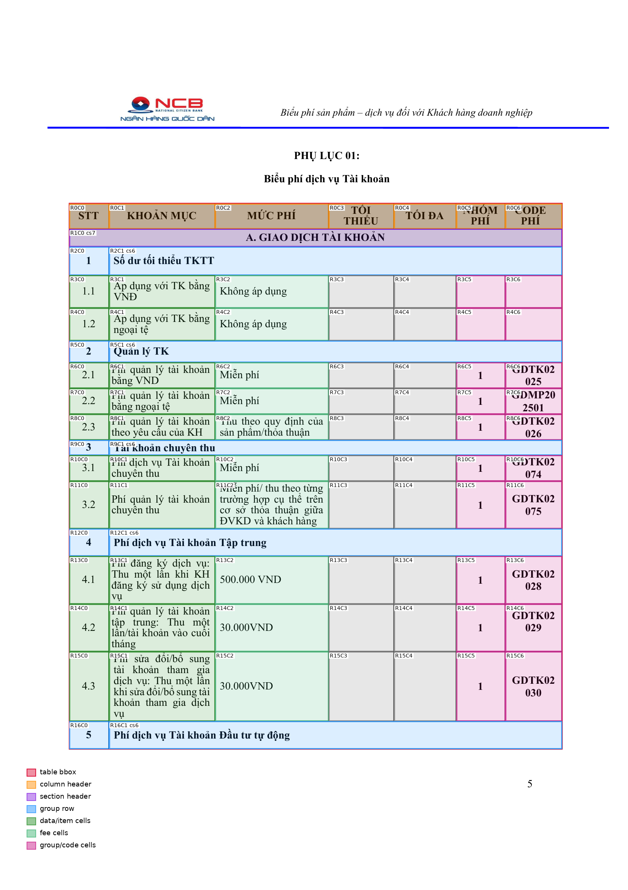
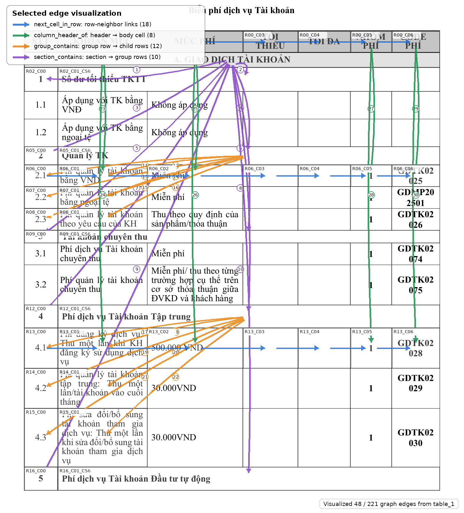

# Dataloader Annotation Guidelines

This directory defines the sample annotation format for page-level document data. Use it when building datasets for OCR, layout detection, table extraction, figure extraction, and downstream field extraction.

The annotation format follows the parser and session database hierarchy:

```text
DocumentSession
└── Page
    └── LayoutElement
        ├── TextBlock
        ├── Table
        │   └── TableCell
        └── Figure
```

## File Layout

Store one annotation JSON file per document, with all annotated pages in the `pages` list.

Recommended path pattern:

```text
src/dataloader/annotations/<document_id>.json
```

The sample file is:

```text
src/dataloader/sample_page_annotation.json
```

Table annotation example files:

```text
src/dataloader/table_annotation.json
src/dataloader/table_annotation_visualization_1.png
src/dataloader/table_edges_sample_visualization.png
```

## Required Page Fields

Each page annotation should include:

- `page_id`: stable page identifier inside the dataset
- `session_id`: document/session identifier
- `page_index`: 1-based page number in document order
- `image_path`: source or curated page image path
- `width`: image width in pixels
- `height`: image height in pixels
- `layout_elements`: annotated regions on the page

## Required Layout Element Fields

Each layout element should include:

- `element_id`: stable element identifier
- `element_type`: one of `text`, `table`, `figure`, `chart`, `header`, `footer`
- `reading_order`: integer order used to reconstruct the page
- `bbox`: page-space bounding box
- `confidence`: annotator or model confidence
- `text`: plain text when applicable
- `markdown`: human-readable markdown output when applicable
- `html`: human-readable HTML output when applicable
- `data`: machine-readable payload for type-specific structures

Bounding boxes use pixel coordinates unless `bbox_units` says otherwise:

```json
{
  "x": 120,
  "y": 96,
  "width": 960,
  "height": 180
}
```

## Type-Specific Data

For text blocks, put paragraph or line data in `data.lines`.

For tables, include:

- `data.rows`: row matrix for simple table content
- `data.cells`: structured cells with row/column indexes, spans, text, bounding boxes, and confidence

For figures and charts, include:

- `data.caption`: caption text if available
- `data.summary`: human-readable visual summary
- `data.linked_text_element_ids`: related text blocks if known

## Table Annotation Example

The table annotation sample uses a bank fee schedule page and demonstrates cell-level table grounding plus graph links between related cells.

- [`table_annotation.json`](./table_annotation.json): full table annotation JSON for the sample table.
- [`table_annotation_visualization_1.png`](./table_annotation_visualization_1.png): bounding-box visualization for the table, rows, columns, and cell roles.
- [`table_edges_sample_visualization.png`](./table_edges_sample_visualization.png): selected graph-edge visualization for row neighbors, column-header links, group containment, and section containment.

### Bounding Box Visualization



The bounding-box visualization checks visual grounding at several levels:

- table bbox
- column headers
- section headers
- group rows
- data/item cells
- fee cells
- group/code cells

### Graph Edge Visualization



The graph visualization shows a readable subset of the full edge set. The full sample contains `88` table-cell nodes and `221` graph edges. The displayed edge types are:

- `next_cell_in_row`: row-neighbor links between adjacent cells
- `column_header_of`: column header to body-cell links
- `group_contains`: group row to child-row links
- `section_contains`: section header to group-row links

### JSON Structure

The full table annotation is stored in `table_annotation.json`. Important fields include:

- `schema_version`: annotation schema version.
- `task`: annotation task name, set to `table_cell_annotation`.
- `document`: source document metadata, including file name, page count, and checksum.
- `coordinate_systems`: supported coordinate spaces. This sample includes both `pdf_points` and `image_pixels`, each using a top-left origin.
- `pages`: annotated pages. Each page records PDF dimensions, rendered image dimensions, and its detected tables.
- `tables`: table objects with `table_id`, title, `bbox_pdf`, `bbox_image`, row/column/cell counts, rows, columns, cells, graph, and notes.
- `columns`: column indexes, names, and column bounding boxes.
- `rows`: row indexes, row labels, row names, and row bounding boxes.
- `cells`: cell-level annotations with `cell_id`, row/column indexes, spans, label, PDF/image bounding boxes, text, confidence, and optional role-specific metadata.
- `graph`: typed relationships between cell nodes, including `source`, `target`, `edge_type`, `confidence`, and edge features.

Merged logical cells are represented with `col_span > 1` or `row_span > 1`. Empty physical cells are still preserved with empty text so the grid remains complete.

## Annotation Quality Rules

- Keep `element_id` stable across annotation updates.
- Use one coordinate system consistently inside a file.
- Preserve page image paths so annotations can be visually inspected.
- Prefer exact table cells over only `rows` when cell-level boxes are available.
- Use `confidence: 1.0` for human verified annotations.
- Use lower confidence values for model-generated or weak annotations.

## Minimal Validation Checklist

Before using an annotation file:

- Every page has `session_id`, `page_index`, `image_path`, `width`, and `height`.
- Every layout element has `element_id`, `element_type`, `reading_order`, `bbox`, and `confidence`.
- Table cell indexes are zero-based and consistent with `data.rows`.
- Figure links reference existing text element IDs on the same page.
- Reading order values are unique within a page.
